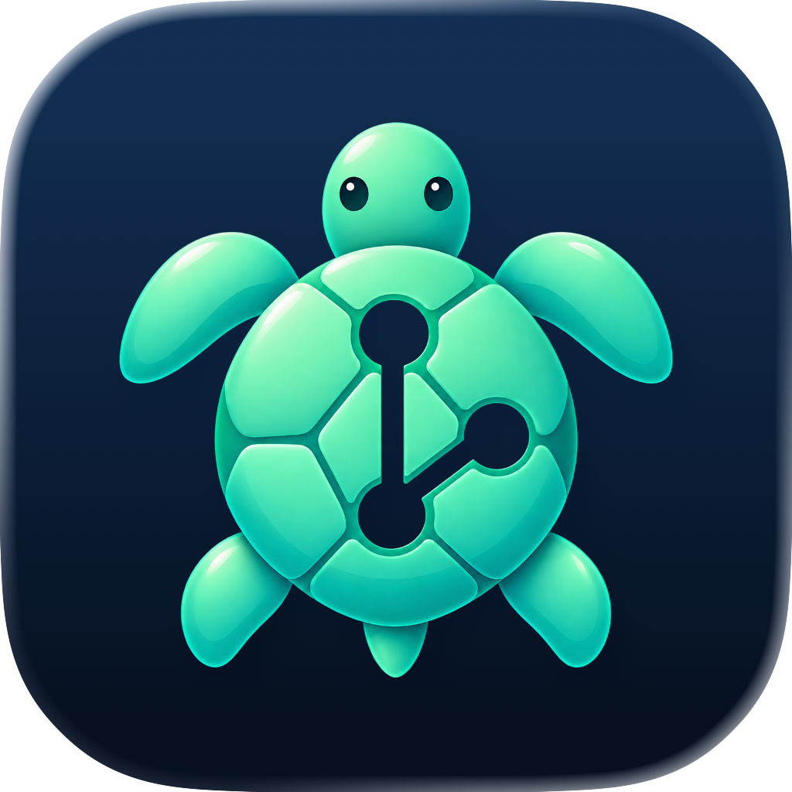
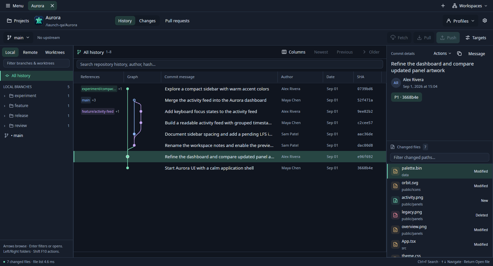
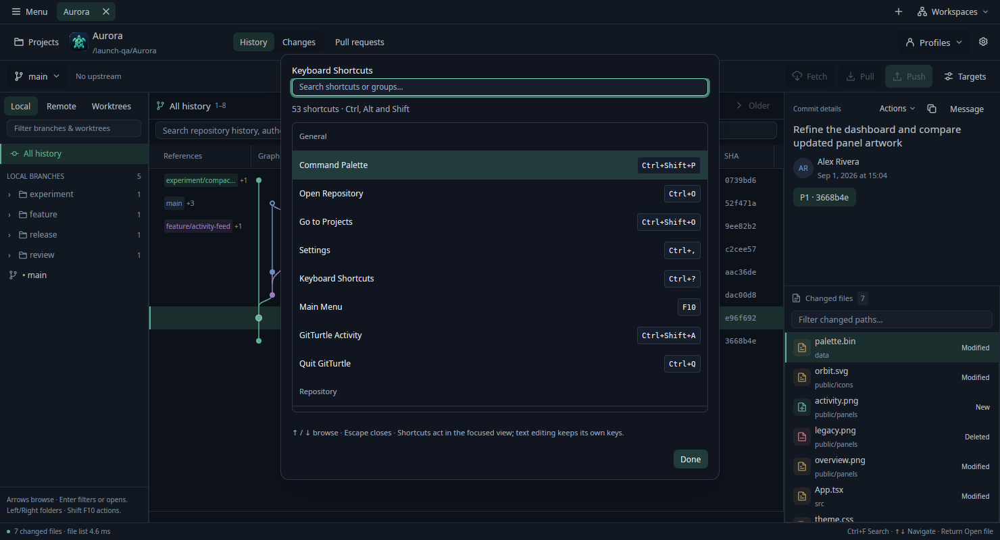

<p align="center">
  
</p>

<h1 align="center">GitTurtle</h1>

<p align="center">A native home for your Git history and everyday work.</p>

<p align="center">
  <a href="#get-started">Get started</a> ·
  <a href="docs/user-guide.md">User guide</a> ·
  <a href="CONTRIBUTING.md">Contribute</a> ·
  <a href="SUPPORT.md">Get help</a>
</p>

GitTurtle is a Git client for **macOS and Linux**, built with Rust and GPUI. Browse history, review code and images, and work with branches and commits in one native workspace. It uses your installed Git, with local browsing and explicit actions for repository writes and network requests.



*Real demo repository in Ubuntu virtual X11, captured within the app's client area. [Screenshot and build details](docs/public-launch-validation.md).*

## Made for the work around a commit

- **Follow the story.** Explore a commit graph, search local history, follow file renames, inspect blame, and compare revisions without losing your place.
- **Review the details.** Read unified or split diffs, stage files, hunks or changed lines, and compare images with side-by-side, overlay and wipe views.
- **Keep projects close.** Switch between repository and worktree tabs, save workspaces, keep an optional grouped project list beside your work, and retain a separate commit draft for each worktree.
- **Work with Git deliberately.** Branch, stash, merge, rebase and recover through named actions and reviews. Fetch, pull and push start when you ask.
- **Make it comfortable.** Choose light and dark themes, independent interface and code sizes, compact or comfortable spacing, and discover commands through menus and keyboard search.

Preview support also includes rendered Markdown, supported 3D formats and macOS PDF pages. See the [format matrix](docs/file-previews.md) and [full feature guide](docs/user-guide.md#current-source-features) for capabilities and limits.

## Get started

GitTurtle is in early development. **Build from source or use a locally prepared bundle**; there are no published release downloads yet. Install [Rust through rustup](https://rustup.rs/) and Git. This checkout selects Rust **1.98.0** through `rust-toolchain.toml`.

```sh
git clone https://github.com/FernandoX7/GitTurtle.git
cd GitTurtle
```

### macOS

Install Xcode 26 or later, including its Metal toolchain. From the repository root:

```sh
./scripts/package-macos.sh
open dist/GitTurtle.app
```

This builds for your Mac's architecture and creates a locally ad-hoc-signed app. It is **not notarized or universal**. For direct source launches and packaging options, see the [user guide](docs/user-guide.md#package-locally-on-macos).

### Linux · Ubuntu 24.04 x86-64

Install the [documented runtime and build dependencies](docs/linux.md#build-from-source-on-ubuntu-2404), then run:

```sh
./scripts/package-linux.sh
python3 dist/gitturtle-linux-x86_64/install.py
```

Run the installer without `sudo`, then open **GitTurtle** from Applications. The bundle installs under your home directory and requires a Wayland or X11 desktop with working graphics drivers. It is a local build bundle, without distribution signing. The [Linux guide](docs/linux.md) covers bundle transfer, checksums, upgrades, troubleshooting and uninstalling.

### Open a repository

Choose **Projects** to open, clone or create a repository, or launch directly from the checkout:

```sh
cargo run --release --locked -p gitturtle -- /absolute/path/to/repository
```

Select a commit to inspect its changed files; activate a file to compare it. **Back** restores your history context. **Working Changes** holds staging and your commit draft. Refresh reads local state; it does not fetch.

## Find your next command

Use the native menu bar on macOS, or **Menu** at the top left of the Linux window (**F10**). Open **Command Palette** with **⌘⇧P** on macOS or **Ctrl+Shift+P** on Linux to search available commands. Choose **Keyboard Shortcuts** from Help on macOS or Menu on Linux to browse the bindings.



See [commands and keyboard navigation](docs/command-palette.md) for contextual availability and behavior.

## Platform status

macOS is the first platform; Linux initially targets Ubuntu 24.04 x86-64. Earlier macOS native checks, a clean Ubuntu userspace build and installation, virtual X11/Wayland interactions, and initial Pop!_OS desktop checks are recorded separately in [validation](docs/validation.md). **Actual Ubuntu GNOME desktop acceptance remains pending.** A successful build or virtual desktop check does not establish that coverage.

Linux does not yet support persistent GitHub account credentials, native PDF rendering or macOS-only image codecs. Git's configured authentication for fetch/pull/push is separate. Some advanced Git operations and preview formats have bounded or unsupported cases; read the [Linux limits](docs/linux.md#platform-limits) and [current feature limits](docs/user-guide.md#current-limits) before relying on them.

## Documentation and community

- [User guide](docs/user-guide.md) · [Linux setup](docs/linux.md) · [Preview formats](docs/file-previews.md)
- [Contributing](CONTRIBUTING.md) · [Design](DESIGN.md) · [Architecture](docs/architecture.md)
- [Report a bug or suggest a feature](https://github.com/FernandoX7/GitTurtle/issues/new/choose) · [Get help](SUPPORT.md)
- [Security reporting](SECURITY.md) · [Code of conduct](CODE_OF_CONDUCT.md)

## Support the project

If GitTurtle is useful to you, [sponsor its development on GitHub](https://github.com/sponsors/FernandoX7). One-time and monthly contributions support maintenance, bug fixes, documentation and platform testing.

Try GitTurtle, report a reproducible bug, improve the docs, or contribute a focused change. [Contributions of all sizes are welcome](CONTRIBUTING.md).

## License

GitTurtle is [MIT licensed](LICENSE). Dependencies and third-party assets retain their own terms; see [third-party notices](THIRD_PARTY_NOTICES.md).
