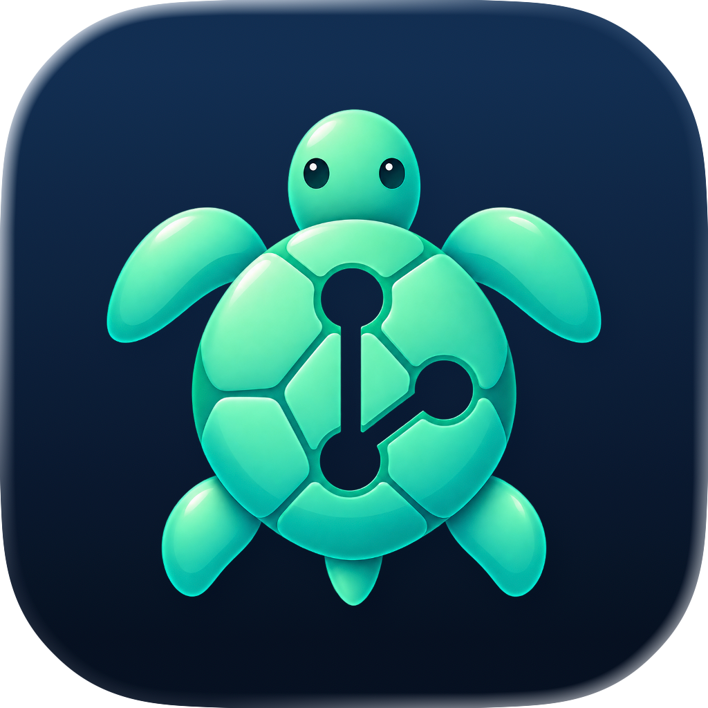
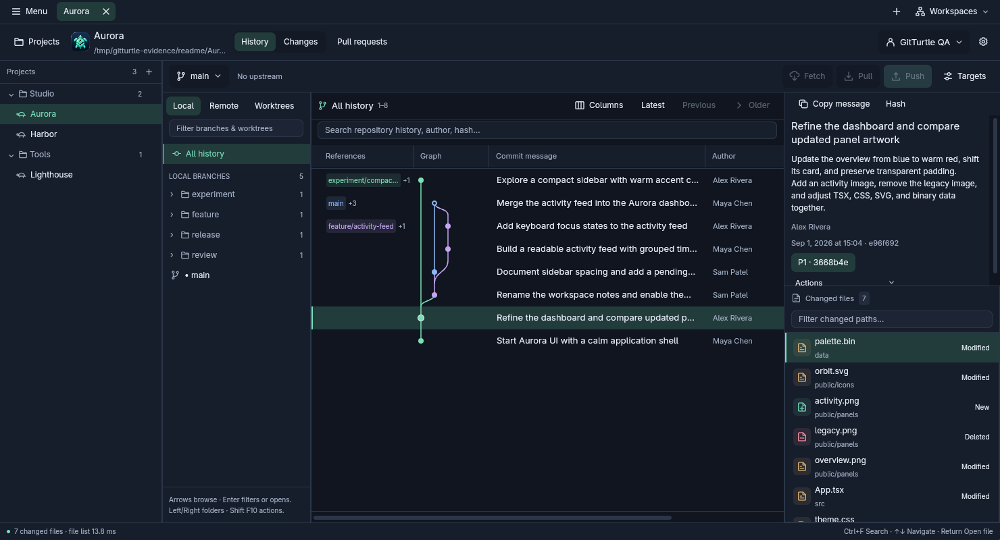
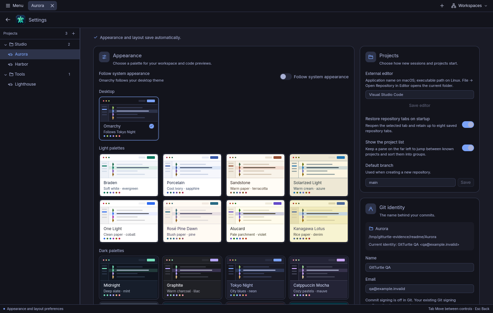
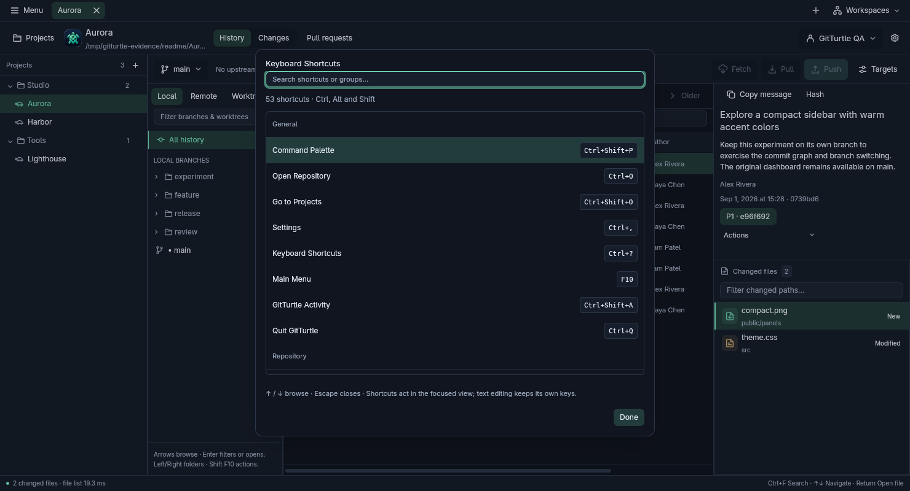

<p align="center">
  
</p>

<h1 align="center">GitTurtle</h1>

<p align="center">A native home for your Git history and everyday work.</p>

<p align="center">
  <a href="#get-started">Get started</a> ·
  <a href="docs/user-guide.md">User guide</a> ·
  <a href="CONTRIBUTING.md">Contribute</a> ·
  <a href="SUPPORT.md">Get help</a>
</p>

GitTurtle is a Git client for **macOS and Linux**, built with Rust and GPUI. Browse history, review code and images, and work with branches and commits in one native workspace, with no Electron, web view or AI features. It uses your installed Git: browsing stays local and read-only, and repository writes and network requests start only when you ask.



*A disposable demo repository, captured natively on Omarchy (Hyprland, Wayland) within the app's window. [Screenshot and build details](docs/validation.md#september-28-readme-screenshots-on-omarchy).*

## Made for the work around a commit

- **Follow the story.** Explore a commit graph, search local history, follow file renames, inspect blame and line history, and compare any two revisions without losing your place.
- **Review the details.** Read unified or split diffs, stage whole files, hunks or single changed lines, and compare images side by side, as an overlay or with a draggable wipe.
- **Keep projects close.** Switch between repository and worktree tabs, save workspaces, group your projects in an optional side list, and keep a separate commit draft for each worktree.
- **Work with Git deliberately.** Branch, stash, merge, rebase, edit local commits and recover through named actions and reviews. Fetch, pull and push start when you ask, and Git keeps your hooks, signing and credential helpers.
- **Stay responsive.** Repository reads, diffs and image decoding run in the background, and long lists draw only the rows on screen.

Previews go beyond text: rendered Markdown with Mermaid diagrams, animated GIF comparison, interactive 3D models (STL, OBJ, FBX, GLB, 3MF and a subset of STEP) and, on macOS, PDF pages. See the [format matrix](docs/file-previews.md) and [full feature guide](docs/user-guide.md#current-source-features) for capabilities and limits.

## Make it yours

- **Themes.** Choose from twenty built-in light and dark themes, follow the system's appearance, or design up to 32 themes of your own in a live editor and share them as files.
- **Omarchy.** On an Omarchy desktop, the Omarchy theme takes its colors from your current Omarchy theme and changes with it when you switch, adjusting them where needed so text and diffs stay readable.
- **Code as you typed it.** Diffs and source views turn ligatures off, so `->`, `!=` and `--` never merge into one glyph. On Linux, code uses a bundled DejaVu Sans Mono, or your desktop's monospace font when you turn on **Use the desktop's monospace font** in Settings.
- **Sizes and spacing.** Set interface and code text sizes separately, and choose comfortable or compact density.



## Get started

GitTurtle is in early development and has no published downloads yet: **build it from source**. Prebuilt releases will be announced on [GitHub Releases](https://github.com/FernandoX7/GitTurtle/releases). You need Git and [Rust through rustup](https://rustup.rs/); the checkout's `rust-toolchain.toml` selects Rust **1.99.0** for you.

```sh
git clone https://github.com/FernandoX7/GitTurtle.git
cd GitTurtle
```

### macOS · Apple Silicon

Install Xcode 26 or later, including its Metal toolchain. From the repository root:

```sh
./scripts/package-macos.sh
open dist/GitTurtle.app
```

This creates a locally ad-hoc-signed app for Apple Silicon. It is **not notarized**, and the packaging script does not build for Intel Macs. For direct source launches and packaging options, see the [user guide](docs/user-guide.md#package-locally-on-macos).

### Linux · Ubuntu 24.04 x86-64

Install the [runtime and build dependencies](docs/linux.md#build-from-source-on-ubuntu-2404), then run:

```sh
./scripts/package-linux.sh
python3 dist/gitturtle-linux-x86_64/install.py
```

Run the installer without `sudo`, then open **GitTurtle** from your applications. The bundle installs under your home directory and needs a Wayland or X11 desktop with working graphics drivers. It is a local, unsigned build, not a distribution package. The [Linux guide](docs/linux.md) covers bundle transfer, checksums, upgrades, rollback, troubleshooting and uninstalling.

### Omarchy and Arch Linux · x86-64

Omarchy already ships the libraries GitTurtle needs. Add three build tools, then use the same packaging script and installer:

```sh
sudo pacman -S --needed rustup python-pillow cmake
./scripts/package-linux.sh
python3 dist/gitturtle-linux-x86_64/install.py
```

On another Arch system, first install the [additional packages](docs/linux.md#arch-linux-and-omarchy) listed in the Linux guide. Hyprland draws no title bar, so GitTurtle shows no window buttons there: quit with **Ctrl+Q** or close the window with your compositor binding. To match your desktop, choose the **Omarchy** theme in **Settings**.

### Open a repository

Choose **Projects** to open, clone or create a repository, or launch directly from the checkout:

```sh
cargo run --release --locked -p gitturtle -- /absolute/path/to/repository
```

Select a commit to inspect its changed files; activate a file to compare it. **Back** restores your history context. **Working Changes** holds staging and your commit draft. Refresh reads local state; it does not fetch.

## Find your next command

Use the native menu bar on macOS, or **Menu** at the top left of the Linux window (**F10**). Open **Command Palette** with **⌘⇧P** on macOS or **Ctrl+Shift+P** on Linux to search available commands. Choose **Keyboard Shortcuts** from Help on macOS or Menu on Linux to browse the bindings.



See [commands and keyboard navigation](docs/command-palette.md) for contextual availability and behavior.

## Platform status

| Platform | Status |
| --- | --- |
| **macOS · Apple Silicon** | The first platform. CI builds and tests every product change on macOS 15 and packages it on macOS 26. The newest appearance work, the theme picker and custom themes, has been checked natively on Linux but not yet on a Mac. |
| **Ubuntu 24.04 · x86-64** | The reference Linux target. CI builds, tests, packages and installs every product change on Ubuntu 24.04, and a clean Ubuntu 24.04 build and installation has been checked. **A full pass on a physical Ubuntu GNOME desktop is still pending.** |
| **Omarchy · Arch Linux with Hyprland** | Supported. Checked natively on Omarchy as a Wayland client: installation, launch, history, Quick Open, opening the folder picker, tiled windows, fractional scales of 1.25, 1.5 and 2, the desktop's monospace font, and the Omarchy theme following real `omarchy theme set` switches. CI builds and tests every product change against current Arch Linux packages. The [Linux guide](docs/linux.md#arch-linux-and-omarchy) lists what has not been checked yet, including other Arch-based desktops. |

Checks, builds and environments are recorded in [validation](docs/validation.md). A successful build or CI run does not stand in for a desktop check.

## Limits and what's next

GitTurtle is young, and some things are not there yet:

- **No prebuilt downloads, notarization or automatic updates.** Local macOS apps are ad-hoc signed; Linux bundles are unsigned.
- **Linux gaps.** PDF pages, AVIF, HEIC and JPEG 2000 images and the system Quick Look preview need macOS. A GitHub account cannot be stored securely on Linux yet, so pull-request review is macOS-only for now; Git's own authentication for fetch, pull and push works as configured. Screen reader and input-method support on Linux has not been checked.
- **Early pull-request review.** On macOS, GitTurtle connects a GitHub.com account through the GitHub CLI to browse pull requests, review changed files and submit comments and reviews. It is covered by tests and offline checks, not yet by a run against a live account.
- **Bounded Git workflows.** Merge-preserving and root rebases and submodule management stay with Git's own tools, and previews, history windows and partial staging have documented size limits.

Read the [Linux limits](docs/linux.md#platform-limits) and [current feature limits](docs/user-guide.md#current-limits) before relying on a workflow. Next up are prebuilt releases, secure GitHub sign-in on Linux, and desktop checks on Ubuntu GNOME and, for the newest features, on a Mac.

## Documentation and community

- [User guide](docs/user-guide.md) · [Linux setup](docs/linux.md) · [Preview formats](docs/file-previews.md)
- [Contributing](CONTRIBUTING.md) · [Design](DESIGN.md) · [Architecture](docs/architecture.md)
- [Report a bug or suggest a feature](https://github.com/FernandoX7/GitTurtle/issues/new/choose) · [Get help](SUPPORT.md)
- [Security reporting](SECURITY.md) · [Code of conduct](CODE_OF_CONDUCT.md)

## Support the project

If GitTurtle is useful to you, [sponsor its development on GitHub](https://github.com/sponsors/FernandoX7). One-time and monthly contributions support maintenance, bug fixes, documentation and platform testing.

Try GitTurtle, report a reproducible bug, improve the docs, or contribute a focused change. [Contributions of all sizes are welcome](CONTRIBUTING.md).

## License

GitTurtle is [MIT licensed](LICENSE). Dependencies and third-party assets retain their own terms; see [third-party notices](THIRD_PARTY_NOTICES.md).
