# Architecture

GitTurtle v0.1 uses Rust and GPUI Kit 0.6 with its matching GPUI dependency set. The app renders native GPU-backed elements and uses the platform repository picker. It contains no webview shell or AI features. Native macOS checks are recorded per build in the [validation notes](validation.md); Linux remains a portability target.

```mermaid
flowchart LR
    Commit[Select commit in History] --> UI[Retained GPUI workspace state]
    File[Activate changed file] --> Compare[Compare mode]
    Compare --> UI
    Back[Back to history] --> UI
    Commit -->|Changed files| Queue[One active read / one replaceable pending request]
    File -->|Selected-file preview| Queue
    Refresh[Refresh local state] -->|Snapshot| Queue
    Watch[Local file events / regained focus] --> Debounce[Coalesced local refresh]
    Debounce -->|When foreground work is idle| Queue
    Search[History search / file history] -->|Cancellable bounded pages| Queue
    Queue --> Session[Retained current worktree session]
    Session --> Git[Read-only Git service]
    Git --> Objects[Persistent cat-file reader]
    Git --> Metadata[Branches / worktrees / history / changed files]
    Objects --> Preview[Text diff or bounded image decoder]
    Preview --> Cache[Byte- and entry-bounded LRU]
    Metadata --> Result[Owned snapshot or content]
    Cache --> Result
    Result --> Generation[Current generation check]
    Generation --> UI
    Hub[Projects: open / clone / create] --> UI
    Write[Explicit stage / commit / branch / integration / recovery / network action] --> Operations[Serialized operation executor]
    Status[Working status / identity / remotes] --> Operations
    Operations --> WorkingGit[Git working-copy service]
    WorkingGit --> WorkingResult[Owned status or operation outcome]
    WorkingResult --> UI
    UI -->|Refresh after operation| Status
    Settings[App settings / recent projects / commit drafts] --> Preferences[Serialized preference writer]
```

## Boundaries

- `crates/git-core/src/lib.rs` owns Git discovery, passive commands, object protocol, byte-safe file paths, parent comparisons, and local LFS resolution. `history.rs` owns bounded search/file-history streams and active process cancellation. Passive commands use fixed arguments and disable helpers, optional locks, lazy fetching, and replacement objects. `work.rs` and its partial-staging, branch, integration, and recovery modules own typed writes and their prepared snapshots. The explicit-write policy preserves normal Git hooks, filters, signing, identity, and credentials without inheriting a different repository or index target from the process environment.
- `crates/preview` owns synchronous raster/SVG decoding and limits. It returns image pixels and original/display dimensions. SVG external content and unsupported effects produce explicit errors. Git symlinks are inspected as stored text, never followed into the filesystem.
- `crates/app/src/worker.rs` owns one active read and one replaceable pending request, retained repository session, graph preparation, render-image conversion, and immutable preview cache. Replacing or cancelling a request signals the active core history process as well as cooperative graph checkpoints. Other Git reads retain individual deadlines. Working-file comparisons use this worker but bypass the immutable cache.
- `crates/app/src/operations.rs` supplies bounded serial executors. `workspace.rs` routes working status and explicit Git operations through one executor; settings, recent projects, and coalesced commit drafts share a separate persistence executor. Accepted operations survive dropped UI reply receivers and are never replaced by selection changes. Queue saturation and panics return errors rather than silently retrying writes.
- `history_search.rs` retains the ordinary history context while showing pinned search results. `file_history.rs` owns a contextual, paged first-parent lineage and restores the previous comparison on close. Both use the existing worker and reject replies from superseded repository/selection generations.
- `local_refresh.rs` owns filesystem subscriptions and bounded event coalescing. `automatic_refresh.rs` schedules quiet reads around foreground work and applies metadata/status without resetting retained browsing state. `commit_drafts.rs` coalesces persistence snapshots per canonical worktree.
- `partial_view.rs`, `split_diff.rs`, and `diff_view.rs` prepare and present text selection, aligned sides, line numbers, and decorations. `editor_find.rs` supplies accessible Find controls and an independent highlight layer over the editor's public search engine. `conflicts.rs` owns bounded manual resolution drafts. `integration.rs`, `branch_actions.rs`, and `recovery.rs` prepare explicit target reviews and submit core commands through the serialized operation executor.
- `projects.rs` owns the native project hub and emits Open/Clone/Create/Back intent. `settings.rs` applies user settings and submits explicit repository identity edits. `preferences.rs` merges the latest stored settings/recents before atomic replacement outside repositories; `appearance.rs` and `columns.rs` own semantic palettes, density, visibility, and bounded column widths.
- `crates/app/src/navigation.rs` builds the local/remote branch hierarchy independently of GPUI. Folder keys include their local or remote namespace; leaves retain their original branch indices. Search reveals matching ancestors, while the caller retains expansion choices. Nesting is bounded at sixteen folder levels without dropping the remaining branch-name suffix.
- The GPUI view owns workspace mode, selection, scope, focus, virtualized lists, and current editors/textures. Each request has a generation; a late result cannot change the current selection. Only the visible text mode creates an editor initially. Refresh resolves reference identity from fresh local state.

## Workspace modes and read stages

Projects, Repository, and Settings are application pages. Within Repository, History and Compare retain the browsing interaction below; Working Changes shows staged/unstaged status and reuses the comparison surface. Opening Projects or Settings does not itself mutate a repository or contact a remote.

History uses the full center height for separate reference, graph, and commit-summary columns. Expandable local/remote branch folders and worktrees occupy the left navigation. A persistent right inspector contains commit metadata, parent comparison, and the changed-file list.

Header and row geometry come from one `ColumnLayout`. The commit-message column remains visible and absorbs spare width; other column visibility and all widths are user preferences. A narrow viewport scrolls the chosen layout horizontally instead of silently removing columns. Theme changes update GPUI controls and custom palettes together; existing editor decorations are rebuilt lazily from retained prepared content.

`GitTurtle` owns the content and history `ResizableState` entities and observes their changes. The resizable groups receive these retained entities through `with_state`; element-local state would disappear when Projects, Settings, or Compare hides a group. Dragged inspector/navigation widths therefore survive those page and mode transitions without rendering hidden repository content.

Selecting a commit changes its heading immediately and requests changed-file metadata. It stays in History. A preferred file or the first file may be highlighted in the right list, but receiving a changed-file list does not automatically request that file's blobs, diff, or image decode. Immutable changed-file reads request Git rename detection with a 1,000-candidate limit; paired old/new paths remain part of preview identity.

Explicit file activation enters Compare and requests only that file's content. Clicking a file or pressing Enter on the highlighted file from either History or the file list activates it. The comparison fills the center height, the navigation becomes a compact rail, and the right inspector stays in place. Changing files within Compare replaces the active preview through the same generation-checked request path. Text sources and decoded images are loaded lazily; constructing editors waits until their Diff, Split, Before, or After mode is displayed.

Back to history changes the workspace presentation and restores history focus using retained state. It keeps the selected commit, scope, query, loaded prefix, and history scroll position rather than submitting another repository snapshot. It also preserves the right-hand commit/file context. Preview completion must not force Compare open after the user has returned to History; stale results must not appear beneath a different file or commit heading.

Content cache identity includes repository, object IDs, both paths, modes, and preview options. Cache lookup occurs when a preview is requested, rather than as part of every commit selection. Missing LFS content is retried; verified content can be reused.

## Search and file history

History input waits for 250 ms of quiet before submitting a search. The worker resolves a selected branch or worktree to its current commit, or captures all local reference tips and detached HEAD. The first result returns that immutable scope; continuation uses it even when refs move. Matching is a literal Unicode-case-insensitive substring search over message, author name, and full hash, independent of the ordinary loaded-history prefix. Graph topology is prepared on the worker for the accumulated matches.

Each response reports scanned commits, a next offset, and a stop reason. Only exhaustion permits a no-more-results claim. Page, scan, byte, and time stops expose explicit Continue or Retry; a zero-progress timeout does not create an automatic retry loop. Cancel retains prior results and stops active history work. Clearing the query restores the saved commits, graph, selection, files, and scroll position; Compare and Back retain the search session. Restart explicitly searches the current tips, including commits created after the captured scope. An explicit History refresh also restarts the scope; automatic and post-write quiet refreshes preserve it.

File history retains an immutable anchor and a byte-safe path, reads 100 revisions per UI page, and follows renames along the first parent. Rows carry exact old/new paths and object IDs, absent deletion sides, the comparison parent, and all actual commit parents. The core replays the bounded prefix before slicing each page because Git's `--follow --skip` can lose rename lineage. Deep pages may reach the 32 MiB or 15-second limit; the error offers an older revision as a new anchor. Opening or closing the contextual pane retains the main history query and selection, and closing restores the previous preview entities, scroll positions, and focus.

## Working changes and explicit operations

Working status is a byte-safe porcelain-v2 snapshot with staged/unstaged entries, original rename paths, conflicts, branch/upstream, ahead/behind counts, and an in-progress Git operation label. Status suppresses configured clean/process filters and filesystem monitors without editing configuration or refreshing the index. Identity and remote discovery read normal Git configuration so the UI can show effective values.

Staged previews compare HEAD objects with index objects from that snapshot. Unstaged previews compare index objects with bounded raw working-file reads. Symlink targets are displayed as stored text; path components are checked before reading a working file. Mutable previews are reread on activation and never put in the immutable commit cache. Status responses check repository identity and a separate generation before replacing visible state.

The UI submits an explicit typed command with its repository and target, disables duplicate writes while it is busy, and refreshes relevant status/history after completion. History-changing writes queue the same quiet refresh used for local events: it re-resolves the valid selected scope while retaining pinned queries, immutable comparisons, viewport, and focus. It does not reopen the repository into All history. File staging passes literal NUL-delimited paths, including both sides of a rename; unstaging preserves working-file content. Commits consume the staged index and a supplied message, retaining Git hooks and configured signing. Branch creation also switches to the new branch; ordinary switching targets an existing local branch without force or remote guessing.

The working inspector measures its actual laid-out height after the header, Targets, and operation feedback consume space. Composer sizing reserves room for the file list and keeps the commit footer outside the scrollable fields; additional guidance, description, or error content scrolls within the composer. Changes to list bounds or density scroll the selected working row into view with nearest-row alignment instead of retaining a pixel offset for the old geometry.

Supported text changes expose hunk and changed-line stage/unstage actions. Their snapshots include HEAD, index entry, attributes, and raw working bytes. The core rechecks them under the real index lock and atomically publishes a copied index, preserving unrelated entries and working files. Files whose filters, normalization, type, size, or rename semantics make partial edits unsafe retain whole-file actions. Ambiguous unterminated-line selections are refused. Commit title and description form a verbatim message; drafts are keyed by canonical worktree, merged by a coalescing serialized saver, and cleared only when the successful submitted draft still matches the current text.

Integration reviews pin the branch and incoming commit before merge/rebase. Conflicts retain raw base and both sides, with labels that account for rebase's reversed roles. The UI keeps bounded text drafts by worktree, path, operation, HEAD, and side identities; unrelated staging does not erase a draft. Manual save, side choice, and marking an externally edited file resolved all revalidate their captured source. Continue additionally pins the staged paths and index identity. External interactive rebase message-editing steps require external continuation. Abort checks whether independent work can be preserved; Quit removes operation state while keeping HEAD, index, and files.

Branch-management plans revalidate names, tips, upstream configuration, and linked-worktree occupancy before tracking creation, rename, safe deletion, or upstream changes. Remote edits preserve unrelated shared configuration and require edits to inherited options at their source. These are local actions. Recovery plans pin the current branch, HEAD, index, repository, and chosen commit or stash. Amend preserves message bytes and configured hooks/signing; Undo moves an eligible single-parent local tip while leaving the index and files intact, refusing known remote containment. Revert/cherry-pick use an explicit parent for merges and share conflict continuation. Stash inspection separates staged, unstaged, and untracked trees; restore never drops the stash, and Drop validates the captured reflog identity rather than trusting a shifted selector.

After a completed nonzero stash-restore command, the core passively checks for unresolved index entries and whether the reviewed stash object remains listed. The compact error distinguishes conflicts from other failures and reports confirmed retention or inability to verify it; details keep both Git output streams and the exit status. Stash conflicts return to ordinary Changes for resolution and staging, with no sequencer Continue/Abort. Timeouts or lost/output-limited results retain their existing uncertainty instead of being reclassified or retried.

Fetch, pull, push, and clone require their own user actions. Pull is fast-forward-only, with rebase and autostash disabled. Push specifies one local-to-remote branch refspec, rejects multiple push URLs, disables force/mirror/tag expansion, and sets the upstream. Network commands disable recursive submodule work and interactive credential prompts; existing credential helpers or SSH configuration must supply authentication. Init/clone require an existing parent and a new or empty destination, never an existing project with content.

Explicit operations have bounded inputs/output and deadlines separate from read cancellation. A timeout, panic, or output failure may follow a partial local or remote effect. Report that uncertainty, preserve the chosen target, and require inspection before a deliberate retry; selection changes must not cancel, replace, or duplicate an accepted write. Repository identity updates use worktree-local configuration when enabled and repository-local configuration otherwise, never global configuration.

## Retained repository session

The worker retains one current `GitRepository` independently of UI selection and preview-cache eviction. Reopening the same canonical worktree root returns a clone of that handle, preserving its shared persistent `cat-file` reader. A nested path still requires Git discovery; if it resolves to the retained root, the existing handle is reused.

Refresh and scope changes continue to read mutable branches, worktrees, and history. Session reuse does not freeze a branch tip or make Refresh use an old snapshot. Linked worktrees have distinct sessions even when they share the same common object directory, because their HEAD and local configuration can differ. Moving to another worktree replaces the retained owner on the worker thread. Returning from Compare to History does not invoke repository discovery at all.

## Quiet local refresh

Subscriptions watch the selected worktree plus its private and common Git metadata, resolved off the UI thread. Events coalesce after 250 ms of quiet with a two-second maximum delay; a bounded metadata fingerprint set suppresses repeated notifications. Returning window focus queues a local rescan. No watcher action fetches or changes Git state.

Automatic reads wait for explicit operations, status reads, foreground reads, pending searches, and active file-history panes. Superseded reads requeue their events; a separate refresh epoch, selection generation, working-status generation, and repository identity reject late replies. Ref updates reanchor the history viewport and preserve the selected comparison even when its commit leaves the visible prefix. A removed branch/worktree scope reports the missing identity while retaining the existing history and refreshing navigation metadata. Completed pinned searches stay pinned while their saved ordinary history receives fresh metadata. Working text previews update retained editors where possible, preserving scroll and conflict drafts. Watch failures surface a local-refresh error and retain manual/focus recovery without a retry loop.

## Budgets and validation

The worker retains at most 32 content entries and 128 MiB of counted CPU payload. Image decoding and Git reads have additional input/output bounds. Graph preparation has lane/edge budgets, with an explicit nodes-only fallback. These are separate controls, not a process-memory cap; UI references and GPU resources have separate lifetimes.

| Interaction | Bound |
| --- | --- |
| Ordinary history | 500-row increments, up to 10,000 loaded commits |
| Search results | 500 per page; up to 10,000 matches or 64 MiB of retained metadata |
| Core search call | 4 KiB query; 50,000 scanned commits, 64 MiB output, or 15 seconds; at most 16,384 captured tips |
| File history | 100 rows per UI page; 32 MiB output and 15 seconds per prefix read; 1,000 rename candidates |
| Text / conflict editor | 2 MiB and 100,000 lines per side; 64 MiB total retained conflict drafts |
| Local event coalescing | 64 queued events, 16 paths per event, 4,096 metadata fingerprints |
| Saved app preferences | 8 MiB, including commit drafts |
| Stash browser | 40 rows per UI page; core reflog snapshot up to 16 MiB or 50,000 records |

The [Git service budgets](../crates/git-core/README.md#budgets-and-behavior) describe raw-object, partial-staging, stash, and write limits. Bounds report incomplete or unavailable work rather than silently truncating editable content.

The UI traces distinguish commit selection through changed-file presentation (`gitturtle.commit_files_frame_ms`) from file activation through preview preparation (`gitturtle.file_preview_frame_ms`). Each ends at a GPUI frame callback and checks the selection generation and workspace mode. These are separate from worker timings and do not measure OS display presentation or completed GPU execution. Back transitions need their own interaction checks; absence of a preview trace is not a zero-latency result. See [validation](validation.md) for the recorded builds, measurements, and limits, and [design](design.md) for the intended interaction language. Incremental ordinary-history traversal, broader content formats, and Linux validation remain follow-up work.

Graph rows hold immutable edges in `Arc<[Edge]>`, prepared by the worker. Visible-row render callbacks share those buffers instead of copying the edge vectors on each redraw. This adds a one-time conversion cost during layout; the [construction and clone benchmark](benchmarks/2026-09-08-shared-graph-edges.json) records both sides of that tradeoff separately from native frame measurements. Empty rows and node-only fallback share empty storage.

Native mode-transition validation should cover commit selection without a preview request, explicit file activation, retained context on Back, and late preview completion after leaving Compare. Exercise keyboard focus, scroll restoration, pane resizing, and the persistent right inspector in the real app. Working-copy tests use disposable repositories to check staged versus unstaged content, hooks/filters, branch and remote targets, and uncertainty handling. Project/settings checks cover destination errors, persistence, theme changes, and column alignment. Automated coverage does not prove rendered transitions; historical validation records remain tied to their original builds.

## Prepared diff presentation

The repository worker prepares unified-patch line numbers, gutter width, decoration ranges, and aligned before/after rows alongside text content. Split rows retain source offsets separately from synthetic alignment padding so copying uses actual file text. Paired read-only editors synchronize scrolling and use editor geometry for gutters; only the selected presentation creates editors. The cache counts the prepared allocations. The UI does not rescan the whole patch for gutter or hunk metadata. Image dragging shares one bounded offset across Before and After, and active drags continue across the application content until release.

Each text editor reserves an empty Find collection without constructing its inputs or panel. The pinned renderer combines overlapping style properties in hash order, so creation order cannot guarantee precedence. App-owned patch handles retain the original styles and remove their backgrounds within painted Find ranges. Find uses a selection tint and an accent underline for the active match, preserving syntax foregrounds; closing it restores the patch backgrounds. Updates visit prepared ranges without rescanning source text, and unchanged match ranges do not rebuild patch styles. Handles remain bounded with weak ownership of source editors. Find's measured header height participates in gutter and split alignment.
