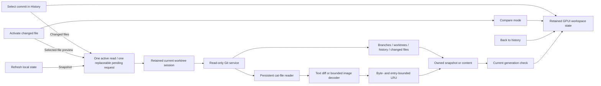

# Architecture

GitTurtle v0.1 uses Rust and GPUI Kit 0.6 with its matching GPUI dependency set. The app renders native GPU-backed elements and uses the platform repository picker. It contains no webview shell or AI features. Native macOS checks are recorded per build in the [validation notes](validation.md); Linux remains a portability target.

## Boundaries

- `crates/git-core` owns Git discovery, commands, object protocol, byte-safe file paths, parent comparisons, and local LFS resolution. Commands use fixed arguments and disable helpers, optional locks, lazy fetching, and replacement objects. Tests compare disposable repository state and exercise configured helpers, unusual paths, missing objects, and read deadlines.
- `crates/preview` owns synchronous raster/SVG decoding and limits. It returns image pixels and original/display dimensions. SVG external content and unsupported effects produce explicit errors. Git symlinks are inspected as stored text, never followed into the filesystem.
- `crates/app/src/worker.rs` owns the replaceable queue, cooperative cancellation checkpoints, retained repository session, graph preparation, render-image conversion, and immutable preview cache. Repository preferences are saved serially here, outside the UI thread and outside inspected repositories.
- `crates/app/src/navigation.rs` builds the local/remote branch hierarchy independently of GPUI. Folder keys include their local or remote namespace; leaves retain their original branch indices. Search reveals matching ancestors, while the caller retains expansion choices. Nesting is bounded at sixteen folder levels without dropping the remaining branch-name suffix.
- The GPUI view owns workspace mode, selection, scope, focus, virtualized lists, and current editors/textures. Each request has a generation; a late result cannot change the current selection. Only the visible text mode creates an editor initially. Refresh resolves reference identity from fresh local state.

## Workspace modes and read stages

History uses the full center height for separate reference, graph, and commit-summary columns. Expandable local/remote branch folders and worktrees occupy the left navigation. A persistent right inspector contains commit metadata, parent comparison, and the changed-file list.

Selecting a commit changes its heading immediately and requests changed-file metadata. It stays in History. A preferred file or the first file may be highlighted in the right list, but receiving a changed-file list does not automatically request that file's blobs, diff, or image decode. The first changed-file list omits rename detection for speed.

Explicit file activation enters Compare and requests only that file's content. Clicking a file or pressing Enter on the highlighted file from either History or the file list activates it. The comparison fills the center height, the navigation becomes a compact rail, and the right inspector stays in place. Changing files within Compare replaces the active preview through the same generation-checked request path. Text sources and decoded images are loaded lazily; constructing an editor waits until its Diff, Before, or After mode is displayed.

Back to history changes the workspace presentation and restores history focus using retained state. It keeps the selected commit, scope, query, loaded prefix, and history scroll position rather than submitting another repository snapshot. It also preserves the right-hand commit/file context. Preview completion must not force Compare open after the user has returned to History; stale results must not appear beneath a different file or commit heading.

Content cache identity includes repository, object IDs, both paths, modes, and preview options. Cache lookup occurs when a preview is requested, rather than as part of every commit selection. Missing LFS content is retried; verified content can be reused.

## Retained repository session

The worker retains one current `GitRepository` independently of UI selection and preview-cache eviction. Reopening the same canonical worktree root returns a clone of that handle, preserving its shared persistent `cat-file` reader. A nested path still requires Git discovery; if it resolves to the retained root, the existing handle is reused.

Refresh and scope changes continue to read mutable branches, worktrees, and history. Session reuse does not freeze a branch tip or make Refresh use an old snapshot. Linked worktrees have distinct sessions even when they share the same common object directory, because their HEAD and local configuration can differ. Moving to another worktree replaces the retained owner on the worker thread. Returning from Compare to History does not invoke repository discovery at all.

## Budgets and validation

The worker retains at most 32 content entries and 128 MiB of counted CPU payload. Image decoding and Git reads have additional input/output bounds. Graph preparation has lane/edge budgets, with an explicit nodes-only fallback. These are separate controls, not a process-memory cap; UI references and GPU resources have separate lifetimes.

The UI traces distinguish commit selection through changed-file presentation (`gitturtle.commit_files_frame_ms`) from file activation through preview preparation (`gitturtle.file_preview_frame_ms`). Each ends at a GPUI frame callback and checks the selection generation and workspace mode. These are separate from worker timings and do not measure OS display presentation or completed GPU execution. Back transitions need their own interaction checks; absence of a preview trace is not a zero-latency result. See [validation](validation.md) for the recorded builds, measurements, and limits, and [design](design.md) for the intended interaction language. Incremental history traversal, aligned split diffs, broader content formats, and Linux validation are follow-up work.

Native mode-transition validation should cover commit selection without a preview request, explicit file activation, retained context on Back, and late preview completion after leaving Compare. Exercise keyboard focus, scroll restoration, pane resizing, and the persistent right inspector in the real app. Existing worker and navigation-model tests cover their own queue, identity, and hierarchy contracts; they do not prove the rendered transitions.
