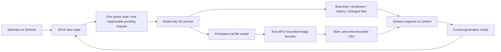

# Architecture

GitTurtle v0.1 uses Rust and GPUI Kit 0.6 with its matching GPUI dependency set. The app renders native GPU-backed elements and uses the platform repository picker. It contains no webview shell or AI features. macOS is validated; Linux remains a portability target.

## Boundaries

- `crates/git-core` owns Git discovery, commands, object protocol, byte-safe file paths, parent comparisons, and local LFS resolution. Commands use fixed arguments and disable helpers, optional locks, lazy fetching, and replacement objects. Tests compare disposable repository state and exercise configured helpers, unusual paths, missing objects, and read deadlines.
- `crates/preview` owns synchronous raster/SVG decoding and limits. It returns image pixels and original/display dimensions. SVG external content and unsupported effects produce explicit errors. Git symlinks are inspected as stored text, never followed into the filesystem.
- `crates/app/src/worker.rs` owns the replaceable queue, cooperative cancellation checkpoints, graph preparation, render-image conversion, and immutable preview cache. Repository preferences are saved serially here, outside the UI thread and outside inspected repositories.
- The GPUI view owns selection, scope, focus, virtualized lists, and current editors/textures. Each request has a generation; a late result cannot change the current selection. Only the visible text mode creates an editor initially. Refresh resolves reference identity from fresh local state.

Content metadata arrives before selected-file decoding. The first changed-file list omits rename detection for speed. Before/after sources and decoded images are fetched only for the selected file. Content cache identity includes repository, object IDs, both paths, modes, and preview options. Missing LFS content is retried; verified content can be reused.

## Budgets and validation

The worker retains at most 32 content entries and 128 MiB of counted CPU payload. Image decoding and Git reads have additional input/output bounds. Graph preparation has lane/edge budgets, with an explicit nodes-only fallback. These are separate controls, not a process-memory cap; UI references and GPU resources have separate lifetimes.

The UI trace measures selection handling through a GPUI frame callback. It is separate from worker timings and does not measure OS display presentation. See [validation](validation.md) for exact measurements and limits, and [design](design.md) for the intended interaction language. Incremental history traversal, aligned split diffs, broader content formats, and Linux validation are follow-up work.
