# Native visual and accessibility evidence — September 10, 2026

These screenshots are unaltered. The [inventory](2026-09-10-next-native-images/manifest.json)
records their hashes and source identities. The user-provided before image has no
inferred executable identity. Images bearing `188ec47` were captured from the release
bundle with UUID `6B923D29-D3B9-3579-B79E-10939AE21C31` while VoiceOver and keyboard
navigation were enabled. Keyboard/AX findings below do not establish spoken
VoiceOver navigation; that manual check remains unverified.

## History graph

The user's single-lane screenshot shows excessive empty graph width pushing the
commit summaries outside the usable viewport.

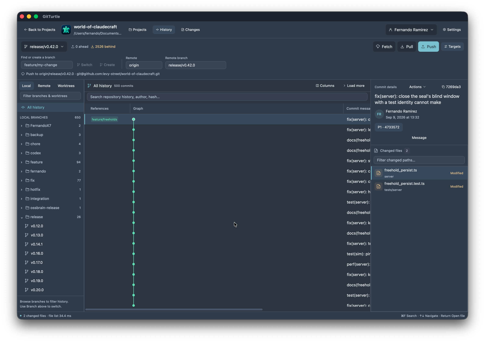

The corrected graph keeps fixed lane spacing and a bounded width. Deep history
also preserves merge edges after the retained window advances to rows5001–6000,
while the original selected commit remains in the inspector.

The final installed `ed9aa21` build also reopened the original repository with
its original Nord preferences. The same single visible lane now leaves commit
messages, authors and dates readable.

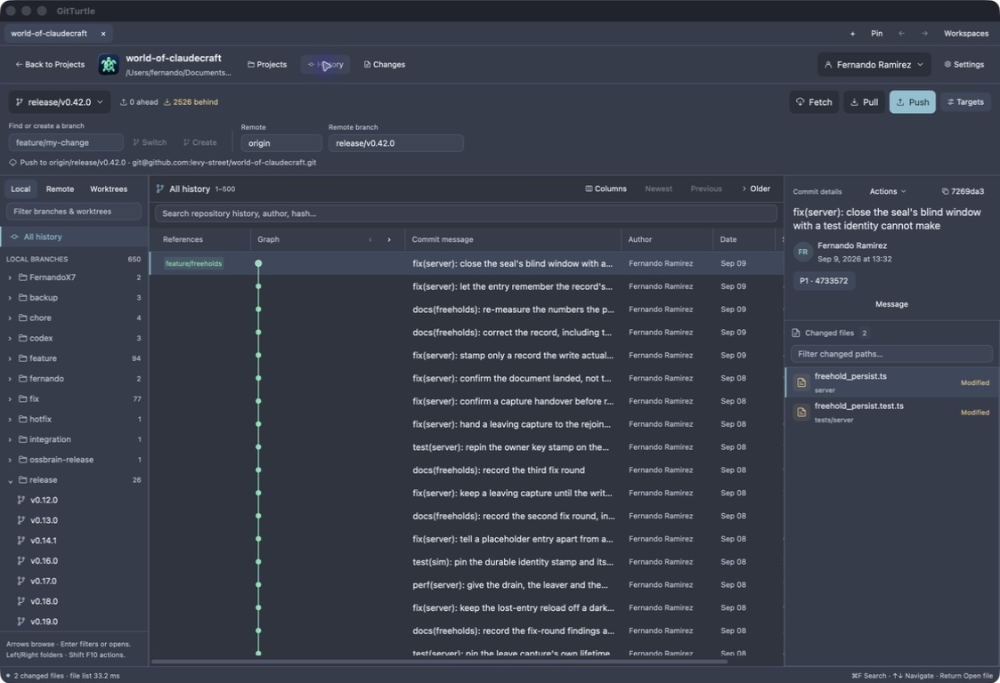

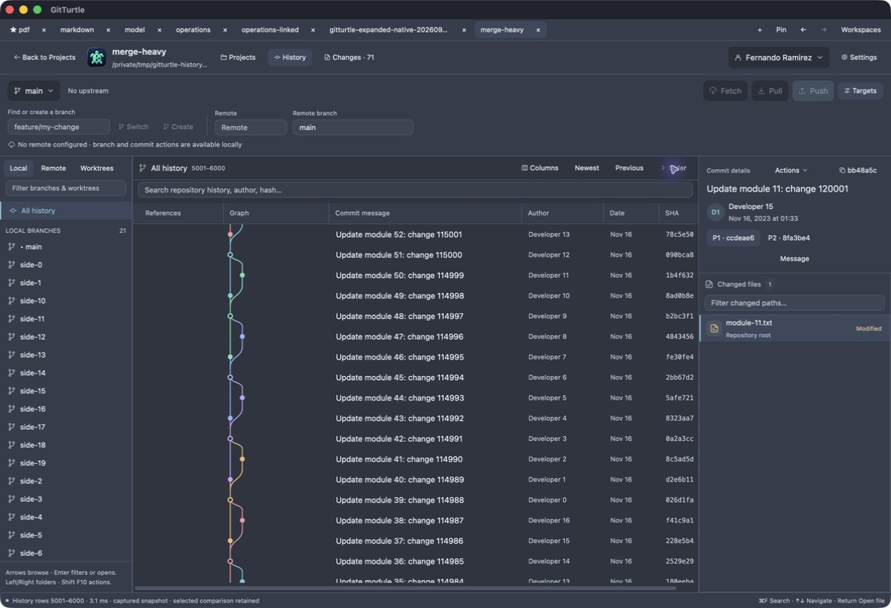

## Native previews and captured writes

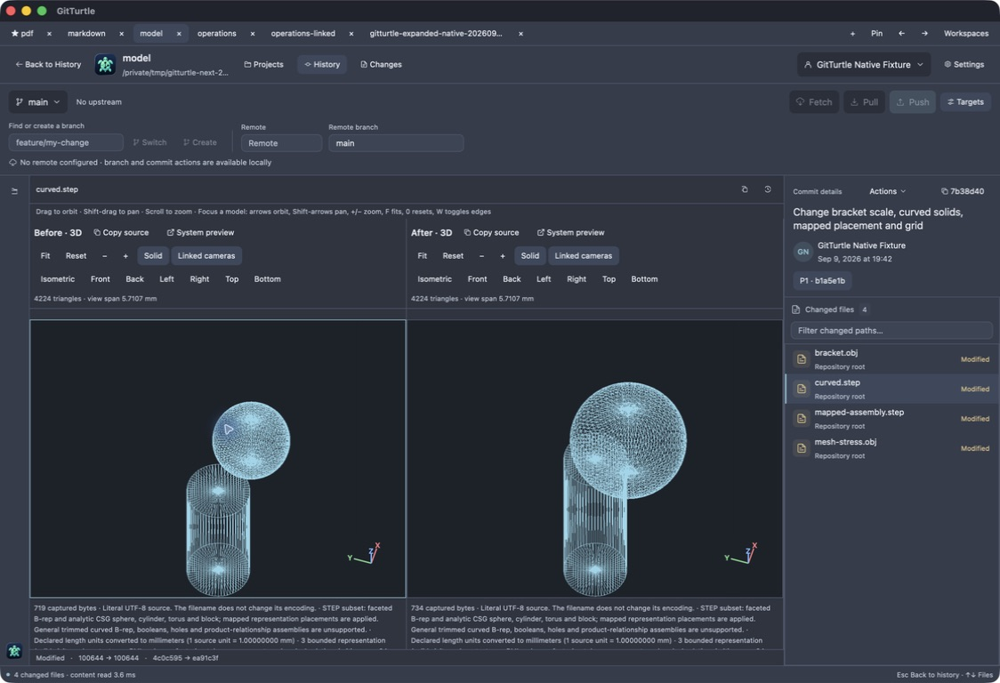

The Before/After model descriptions expose 4,224 triangles, camera orientation,
physical view span and keyboard commands. Orbit, pan and zoom affect both sides
when linked; fit/reset restores their common scale. This is the documented finite
STEP subset, not general trimmed/NURBS STEP support.

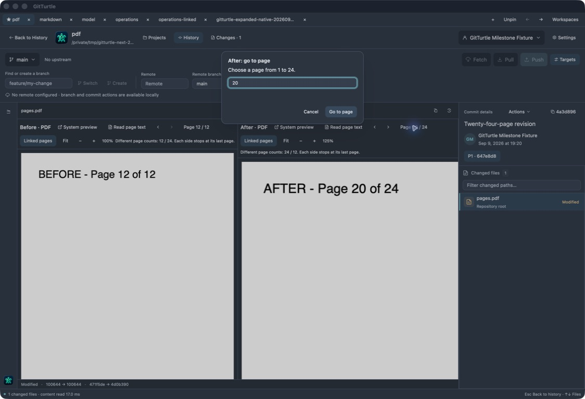

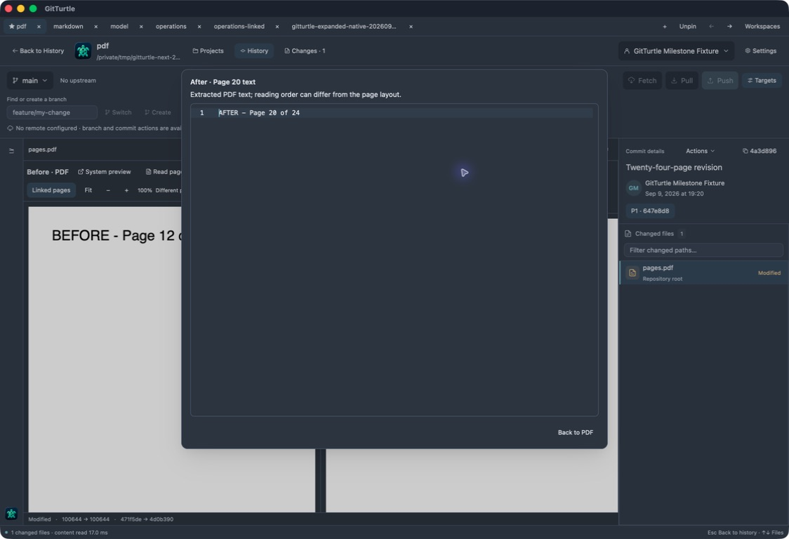

The page dialog exposes `After: go to page` and its actual numeric field. The
reader exposes `After · Page 20 text` and the exact extracted text. The separate
`58f09ff` candidate recheck established Find-first Escape and selected-file focus
restoration; the Session B marker withdrew that interaction claim for `188ec47`.
Linked navigation clamps the 12-page Before revision while After continues through
its 24 pages.

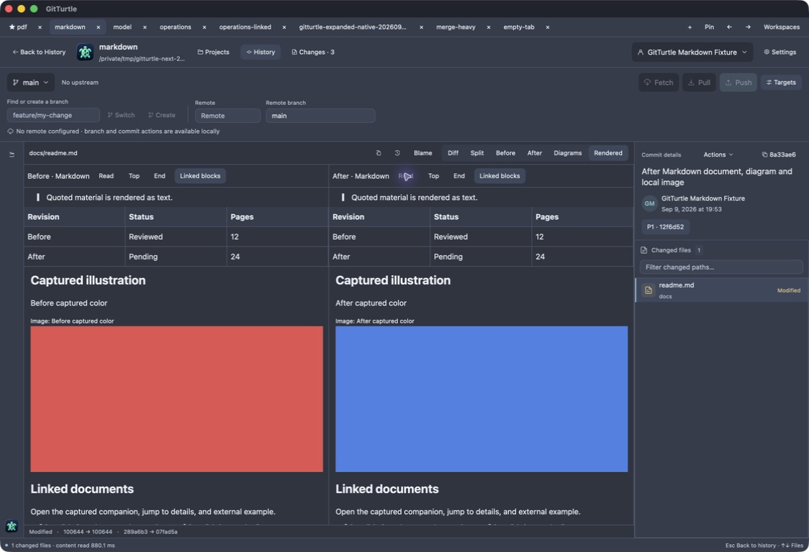

Rendered Markdown exposes table column/row descriptions, headings, links and
Before/After image labels. Keyboard reading moves bounded blocks. Historical
image bytes remain distinct from the working-tree replacement.

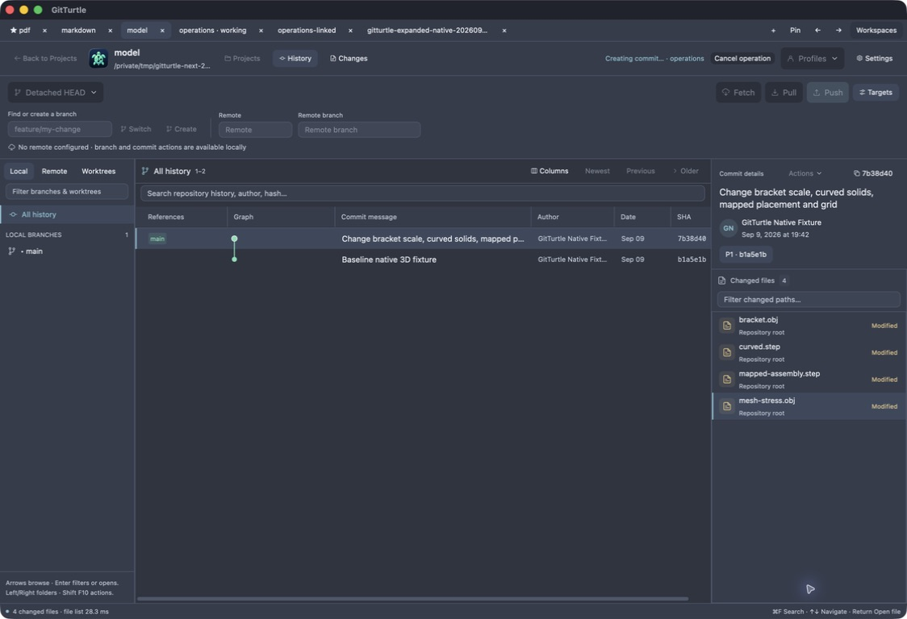

The model tab is active while the operations tab and busy indicator identify the
captured commit repository. The actual commit touched only the reviewed fixture
file; the linked worktree retained its prior HEAD and private index.

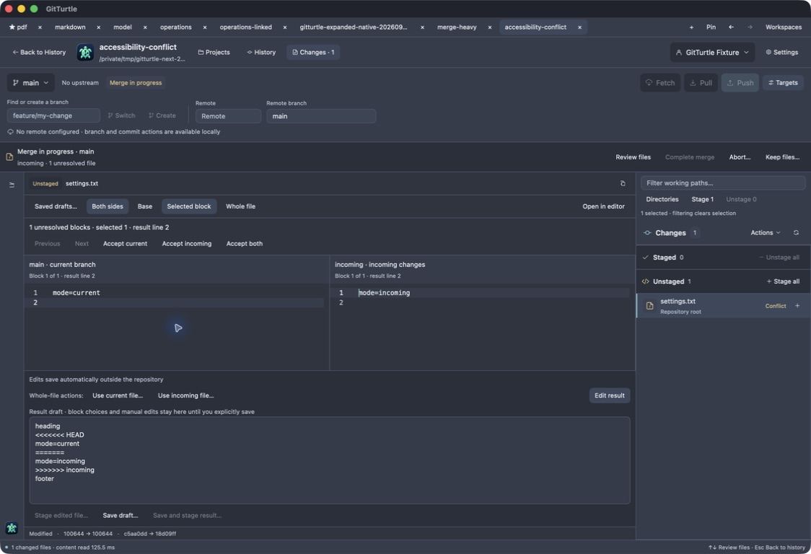

Conflict editors identify current and incoming branch versions. Tab moves between
the actual editors; the selected block count and result text are exposed. This
inspection did not resolve or stage the conflict fixture.

## Installed confirmation and draft rechecks

The following images were captured from the installed `bfc4423` executable,
UUID `57CE2CF1-65D6-36E7-8CC2-5DD06FEE50DF`, with VoiceOver still enabled.
Subsequent session-close persistence changes are separately identified in the
milestone ledger.

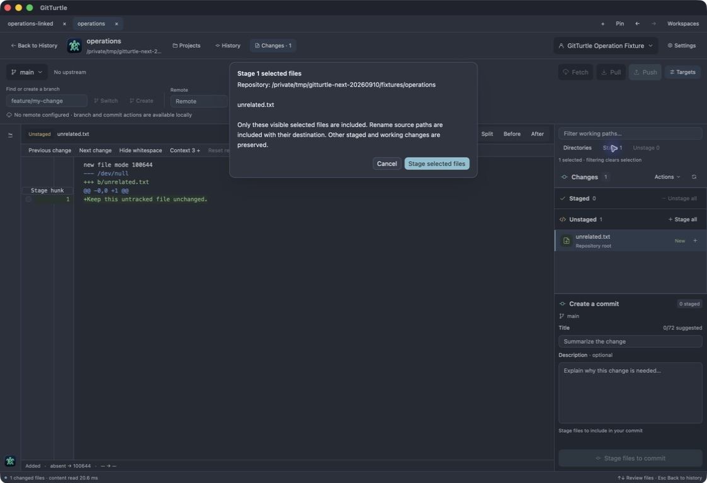

The dialog's actual accessible name is `Stage 1 selected files`; Escape cancels
and preserves the fixture's untracked content and index.

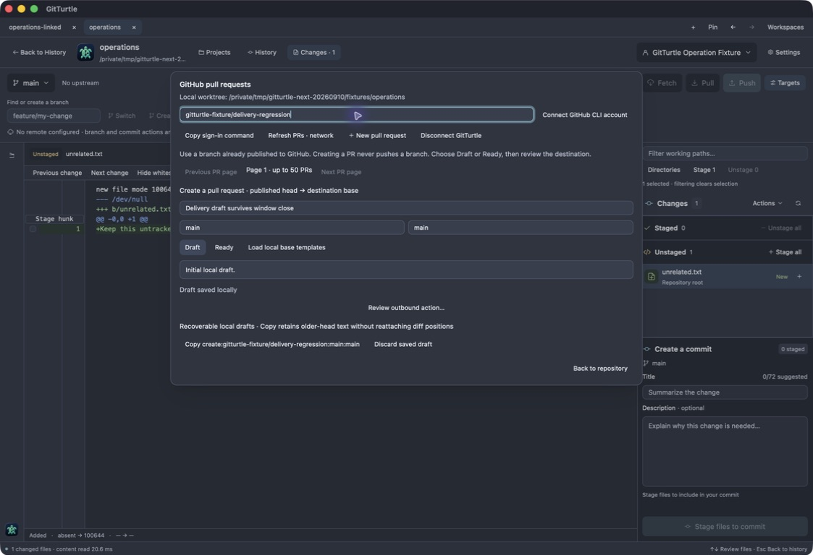

Correcting a populated form's destination produces one saved draft after the
quiet period. A later final edit was pasted and the last window closed within
67 ms, before the 500 ms timer. The exact final text was durable after normal
process exit and available from the native panel after restart. No account
connection or network action was performed.

## Final installed session restoration

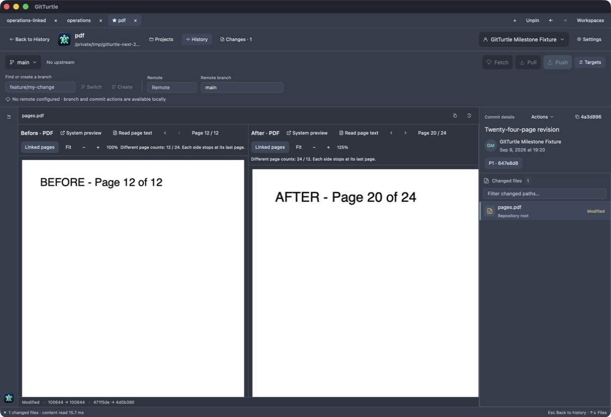

Source `ed9aa2102ff2d35d4d6cb714d2cf6724ed79eb64`, UUID
`2CC15A0C-CB56-343B-929B-BAB099A289D8`, sole installed process. A newly opened PDF
tab was saved after metadata loaded. Closing the final window 19 ms after the zoom
click completed preserved all three tabs, the active comparison, linked Before
page 12 / After page 20, and After 125% zoom. A normal no-argument launch restored
that exact view; Back retained the `Twenty-four` history query. Original VoiceOver
and keyboard-navigation settings were OFF for this final check.
