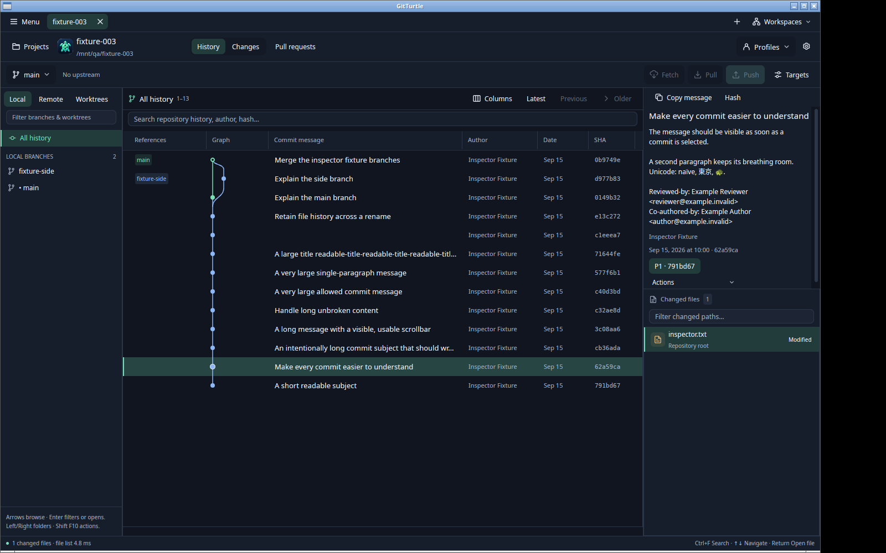
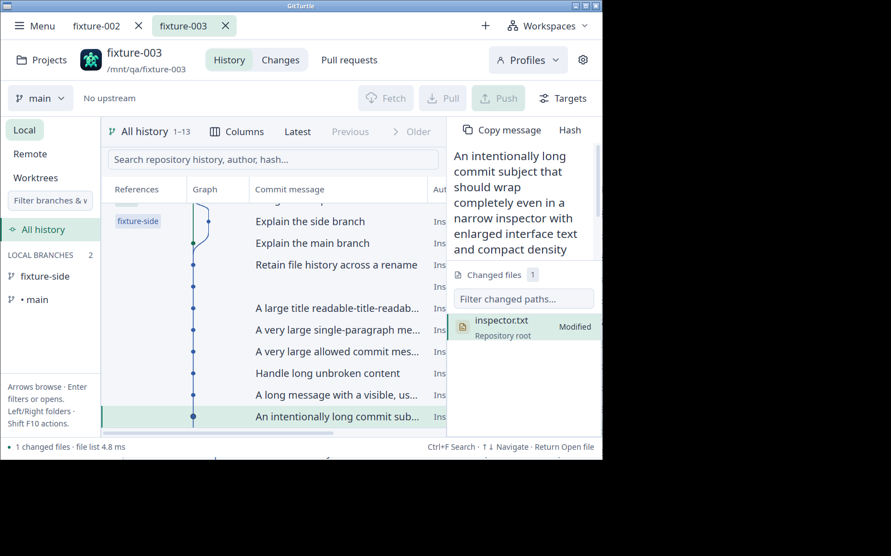
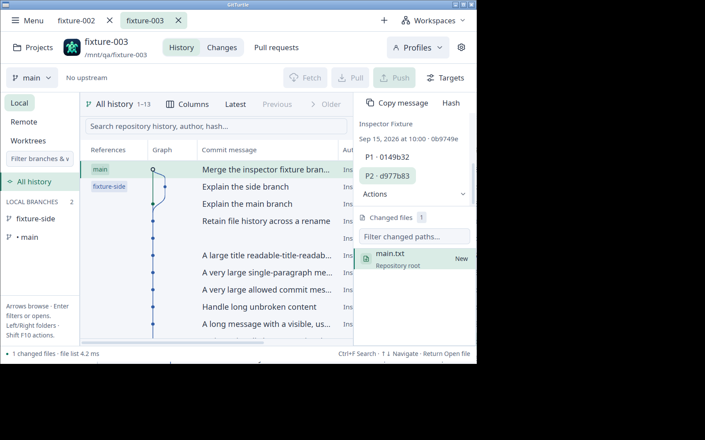
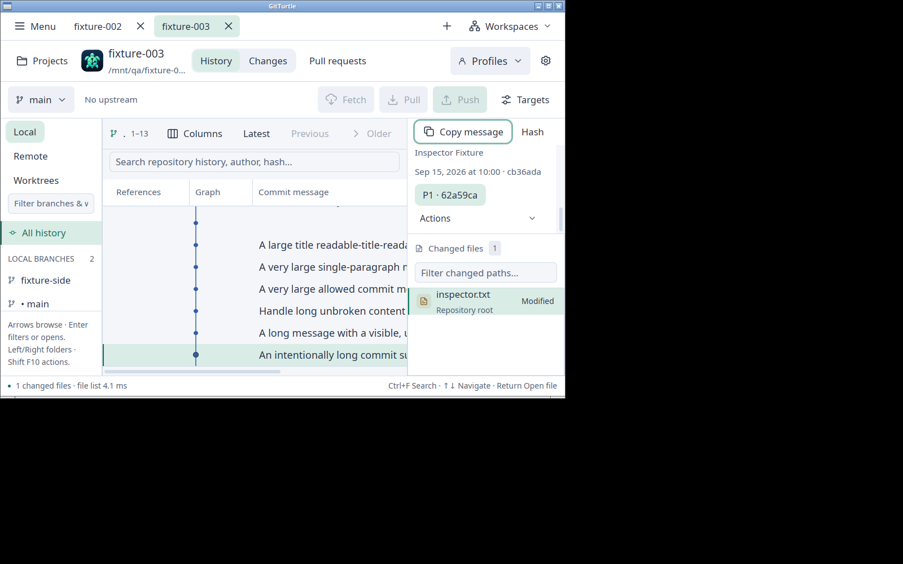

# September 15 commit inspector and Linux package evidence

## Exercised build and environment

The final interaction and package checks used clean source
`eebf47acfdb849fab96685c7b8d8a1c058578259`, version `0.1.0`,
`x86_64-unknown-linux-gnu`, release profile. The executable SHA-256 was
`885c8409ddb40f6e75161fb4be3db29f4f0e7b6aeef203afc15b8f5c0d83dba1`.
The live process executable, packaged executable and installed executable matched
that digest. Later CI/release source and test-fixture changes do not represent
another native build; this record applies to the identified executable.

The app ran in a private Ubuntu 24.04 userspace with Xvfb/Openbox X11, software
rendering and 1× display scale. Screenshots and AT-SPI state were inspected in
addition to actual pointer, keyboard and accessibility actions. This is virtual
X11 evidence, not physical Wayland, GPU-performance, spoken screen-reader or
macOS evidence. The maintainer will perform macOS verification separately.

The disposable repository contained 13 scenarios, including empty messages,
Unicode/trailers, long titles, many paragraphs, large supplied text, a rename and
a two-parent merge. All 98 recorded repository entries remained byte-identical
after the complete passive interaction sequence. Genuine user repositories and
app settings were not used for mutation fixtures.

## Inspector observations

- Full subjects and bodies appeared immediately on selection. Paragraphs and
  trailers remained readable. The viewport kept the copy controls and changed
  files available while scrolling long messages.
- Midnight/Comfortable at 13 points and Braden/Compact at 18 points were exercised,
  including the actual 1000×680 minimum window, a 1080×800 window and an
  approximately 280-point inspector. Long
  subjects wrapped; End reached their final body and parent controls without
  collapsing the changed-file area.
- Full-message copies matched the loaded core model for empty text, a 293-byte
  Unicode/trailer message, a 228-byte wrapped-title message, 65,594-byte unbroken
  content, an 8,347-byte paragraph message, a 1,600,039-byte single-paragraph
  message and a 1,500,056-byte subject/body. Full hash copies matched the selected
  merge and nested File History revision. Pointer activation of Copy also passed.
  The core model removes trailing body newlines; this is not a raw-object copy.
- Actual keyboard Home/Page Down/End scrolling, focus traversal and Return
  activation of both copy controls passed. Compare/Back, nested File History across a rename,
  warm repository-tab return and Projects/Settings return preserved the relevant
  inspection. Rapid selection ended with the final chosen commit and matching
  copied hash. Choosing the merge's second parent changed the file list from
  `side.txt` to `main.txt` while retaining the merge message and hash.
- Native testing found visible message text had empty AT-SPI labels. Commit
  `eebf47a` corrected the AccessKit static-text value. The rebuilt app exposed the
  actual visible text; the consuming regression failed before the fix and passed
  afterward. This establishes native accessibility text, not a spoken-reader pass.
- Unicode rendering used the standard Ubuntu Noto CJK fallback font in isolated
  QA app data. A fresh isolated installation initially lacked that optional font;
  after installing the same verified Ubuntu font dependency and restarting,
  Japanese and emoji displayed correctly. No font was silently added to the app
  package. Missing system glyph coverage remains a desktop dependency.

The initial `697af39` interaction exposed the accessibility defect and remains
preserved as pre-fix evidence. Its successful large-message and retained-scroll
checks are identified separately in the private capture inventory.

## Actual Linux package and installation

The development archive was
`gitturtle-0.1.0-eebf47acfdb8-linux-x86_64.tar.gz`, 27,351,052 bytes, SHA-256
`da694b4efa61c165464bbde7d1924ca3fde3086c483ac78a4abb8c11f3f14be8`.
It accurately reports unsigned development status, the clean compiled source,
package identity, lockfile and license inventory digests.

The real archive was checksummed, extracted and installed in disposable homes.
All 20 installer tests passed, including real-payload installation, upgrade,
rollback after bundle removal and corrupt-payload refusal. The prior upgrade
payload in that test is synthetic; it does not prove compatibility with an older
released app's settings. Installed bytes, retained notices/metadata, desktop entry
and dynamic libraries were checked. The installed executable launched the native
app and relaunched after the extracted directory was moved. Repository snapshots
remained unchanged.

Strict distribution packaging refused the two unresolved notices (`mac 0.1.1`
and `ufbx 0.11.3`) and left no final bundle, archive or sidecars. The development
inventory retained all 692 dependency records and explicit review requirements.
C0 remains open; this archive is not cleared for public binary distribution.
Actual Actions artifact upload/download remains C3 evidence, separate from these
local archive and desktop checks.

## Evidence and remaining scope

The coordinator retains the binaries, archive, fixture manifest, before/after
snapshots, capture metadata, clipboard digest comparisons, source reviews and
failure diagnostics outside the immutable task specification. The committed
[screenshot inventory](2026-09-15-commit-inspector/screenshots.json) binds the
images above. These are inspected native captures, not rendered mockups.

Focused inspector tests, the full workspace and strict workspace Clippy passed
for `eebf47a`. Hosted `697af39` later exposed a startup-worker race in the new test
fixture and macOS temporary-path aliases in package tests. Commit `b49c81c`
repairs test setup without changing production behavior; hosted confirmation is
recorded separately on PR #9. Neither a local pass nor this native record claims
hosted CI, macOS packaging or Apple notarization passed.
