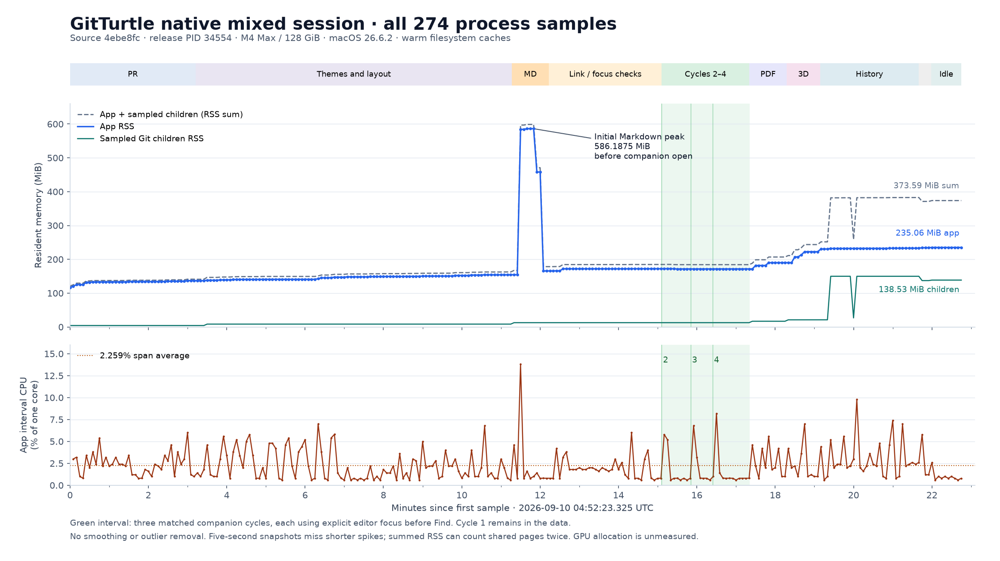

# Native mixed-session resource evidence for source 4ebe8fc

The release completed a marked **21m58.100s** mixed native review. Three matched 69-byte Markdown companion cycles settled at **171.484–171.500 MiB**, with explicit editor focus required before Find. The largest app RSS sample was **586.1875 MiB during initial Markdown loading**, before any companion open. Final quiet app RSS was **235.0625 MiB**. Two native interaction failures found in this measured executable were subsequently corrected and retested; their separate final-build evidence is linked below.

Source `4ebe8fc834f7c03674828407e78ece29c6aa4d9c`; PID `34554`; mapped executable SHA-256 `1fc08c8560041f9232b0c9cad824dfd9488bf904343b981b19c1e532b80d6503`. The observer checked PID/start identity and mapped device/inode, with unchanged executable hash at its footer. Source was declared by the build owner and tied to the recorded input manifest; the observer does not derive a commit from executable bytes.

Hardware: Apple M4 Max, 16 logical CPUs, 128 GiB RAM; macOS 26.6.2 (25G83), arm64. Release startup was settled with eight QA tabs and warm filesystem caches. Fixtures included offline PR review, captured Markdown, a 24/12-page PDF pair, a 12,800-triangle model pair, and 120,000-commit history. This was a mixed interactive workload with natural pauses, not a latency benchmark.

The workload markers span **2026-09-10 04:52:24.276479–05:14:22.376071 UTC**. The approximate “21m45” end note is superseded by their exact 1318.099592-second difference. All **274 samples** span 04:52:23.325477–05:15:08.229404 UTC (22m45.005s); the observer footer at 05:15:13.173813 reports `target_unavailable`, following the operator’s normal CmdQ. The final idle interval includes ten samples spanning 45.000s.



The chart shows all samples without smoothing; the pale interval is the matched companion series with its explicit focus workaround. The [SVG chart](resource-timeline.svg) is also available for export.

## Final native retest and installation status

The minimum History scrollbar overlap and captured Markdown source Find routing
were corrected and passed affected native retests on `28a5d43`. Subsequent exact
conflict-draft and cold History restart corrections passed native checks on
`cc4ffac` and `eb3dd26`, respectively. Final source
`eb3dd264c3d03eda7a3e937d307bf100c603ef02` passed macOS/Linux gates, was installed
at `/Applications/GitTurtle.app`, and passed the installed-path identity and
Compare/Back/Settings smoke checks. Genuine app state and system settings were
restored. See the [milestone record](../../native-polish-milestone.md),
[final validation evidence](validation.json), and [unaltered visual comparison](visuals/README.md).

The measurements below remain attached to source
`4ebe8fc834f7c03674828407e78ece29c6aa4d9c`; they were not rerun or reassigned to
the final build.

## Resource measurements

| Resource | Median | p95 | Maximum | First → last |
| --- | ---: | ---: | ---: | ---: |
| App RSS, MiB | 154.430 | 235.062 | 586.188 | 116.875 → 235.062 |
| Interval CPU, % of one core | 1.800 | 5.800 | 13.802 | 2.997 → 0.800 |
| Threads | 15.000 | 26.000 | 26.000 | 14.000 → 20.000 |
| Fresh numeric FDs | 12.000 | 21.000 | 21.000 | 9.000 → 15.000 |
| Git child count | 3.000 | 7.000 | 7.000 | 1.000 → 4.000 |

The app used **30.83 CPU seconds**, averaging **2.259% of one core** across the sample span; marker endpoints give 30.43 CPU seconds / 2.309% during the marked workload. The final idle samples averaged 0.822% of one core and ranged 235.0625–235.140625 MiB. The final state includes warmed repositories, history and caches, so its 118.1875 MiB increase over startup is not an isolated retention test.

FD statistics use only 46 fresh 30-second observations; intervening CSV values are explicitly marked stale. FDs fell from the observed maximum 21 to 15, while Git children fell from 7 to 4 after tab cleanup. Sampled child RSS was **138.531 MiB final**, **149.797 MiB maximum**. The largest final Git child alone held 126 MiB. App plus child RSS summed to **373.594 MiB final** and **598.859 MiB maximum**; these non-atomic sums may count shared pages repeatedly. The sampler recorded command names, not child arguments or cumulative child CPU. Persistent per-repository object readers are consistent with [crates/git-core/src/lib.rs](../../../crates/git-core/src/lib.rs) (measured lines 154, 942) and [crates/app/src/worker.rs](../../../crates/app/src/worker.rs) (measured line 381), but their identity is not proven by the command-name samples. All four final-sample child PIDs were absent on read-only checks after app quit, recorded in [interpretation.json](interpretation.json).

There were no collection errors, truncated descendant lists, duplicate-app events, or failure trace records. All 48 parser warnings are preserved layout-state lines outside the callback/lifecycle parser, not failed operations. Sampler collection time was 67.808 ms median / 123.904 ms p95 / 153.393 ms maximum; scheduling lag stayed below 6.356 ms. Background sampling found no compiler processes, but system load varied 4.066–18.469 and unrelated processes were active. This is not an uncontended comparison.

## Companion cycles and initial Markdown peak

Cycle 1 remains in every data file, including its correction marker. Its first note overstated successful Find/Escape: immediate CmdF after Exact source opened the background History search. Only cycles **2–4** count as matched successes: open Rendered companion → Exact source → **explicit editor focus workaround** → Find → Escape → Back to document, without a repository/tab switch.

| Cycle | Active duration, s | App CPU seconds | Return RSS, MiB | Quiet interval, s | Last quiet sample, MiB |
| --- | ---: | ---: | ---: | ---: | ---: |
| 2 | 7.038 | 0.53 | 172.312500 | 37.432 | 171.484375 |
| 3 | 6.597 | 0.47 | 171.546875 | 26.977 | 171.500000 |
| 4 | 6.557 | 0.46 | 171.546875 | 49.468 | 171.500000 |

All three cycles and their quiet intervals share trace offset 5817 with no added image or callback records; three previously tracked images remained. This is evidence of stable endpoints for this small companion workload, not evidence that the default focus routing works or that larger documents have identical costs.

Initial Markdown RSS rose from 154.390625 MiB at 05:03:48 to 584.234375 MiB at 05:03:53, peaked at **586.1875 MiB at 05:04:13.251968**, fell to 458.109375 MiB at 05:04:23 and **165.671875 MiB at 05:04:28 and 05:04:33**. The first companion open marker is later, 05:04:36.802918. The initial Markdown phase contains a 541.912 ms file-preview callback. The first retirement of three images follows the companion-start marker, after RSS had already fallen. This peak is retained as an initial Markdown/diff transient; neither a leak nor a root cause is established.

Source references use line numbers from the measured commit; the linked repository files may have changed afterward. Inspection at that commit identifies plausible allocation paths: worker preparation creates diff/split and Markdown/Mermaid models ([crates/app/src/worker.rs](../../../crates/app/src/worker.rs) (measured lines 1546, 1682)); first-use Mermaid text metrics load a system font database and selected font bytes ([vendor/mermaid-rs-renderer/src/text_metrics.rs](../../../vendor/mermaid-rs-renderer/src/text_metrics.rs) (measured lines 11, 66, 128)); SVG decoding has its own lazy font database ([crates/preview/src/lib.rs](../../../crates/preview/src/lib.rs) (measured line 413)). The captured Markdown sides are only 1,156/1,153 bytes with one Mermaid block and one 320×160 PNG each; those direct bytes alone cannot explain the transient. These are candidates, not allocation attribution. No heap, VM or GPU profile was collected.

## Every callback measurement

These are elapsed interaction-to-next-frame-callback values from [crates/app/src/main.rs](../../../crates/app/src/main.rs) (measured line 1233), guarded by current generation/mode. They include worker and scheduling delay; they are neither frame rendering CPU duration nor input-to-visible/GPU completion. Trace lines have no timestamps, so phases below use marker byte boundaries only. [callbacks.csv](callbacks.csv) preserves all 16 records.

| Trace line | Phase | Metric | Milliseconds |
| ---: | --- | --- | ---: |
| 2 | before-mixed-marker | commit_files_frame_ms | 51.582 |
| 3 | themes | commit_files_frame_ms | 41.398 |
| 44 | themes | file_preview_frame_ms | 4.418 |
| 50 | markdown-tab | commit_files_frame_ms | 43.536 |
| 51 | markdown-tab | file_preview_frame_ms | 541.912 |
| 56 | markdown-correction | file_preview_frame_ms | 136.941 |
| 59 | markdown-correction | file_preview_frame_ms | 3.045 |
| 61 | pdf-preview | commit_files_frame_ms | 37.233 |
| 62 | pdf-preview | file_preview_frame_ms | 6.900 |
| 67 | model-preview | commit_files_frame_ms | 31.875 |
| 68 | model-preview | file_preview_frame_ms | 2.412 |
| 80 | model-preview | file_preview_frame_ms | 265.082 |
| 83 | model-preview | file_preview_frame_ms | 2.738 |
| 99 | deep-history | commit_files_frame_ms | 33.477 |
| 102 | deep-history | history_page_frame_ms | 7.678 |
| 103 | deep-history | commit_files_frame_ms | 33.358 |

The three file-preview values above 100 ms are **541.912** (initial Markdown), **136.941** (Markdown correction/revisit interval), and **265.082** (model interval). No outlier is removed. Commit-files callbacks: n=7, median 37.233 ms, maximum 51.582 ms; file-preview callbacks: n=8, median 5.659 ms, maximum 541.912 ms; history-page callback: n=1, 7.678 ms. The 51.582 ms record precedes the mixed-start marker and is preserved, not attributed to a later phase. These small heterogeneous samples do not establish tail-latency improvement.

## Image lifetime and cleanup

All **40 image lifecycle records** are preserved: 30 tracked images/frames, 22 retired images/frames, maximum 13 retained images. The final recorded cleanup retires three images and reports **11 → 8 retained**, between cleanup/start and mixed/end marker offsets 8052–8111. There is no later image-window-close or zero-retention record. The operator closed the Markdown, PDF and model tabs and observed the views disappear; CmdQ then ended the process. After native picker cancellation the valid focus target was the **Commit History list**, not a search input.

The registry holds one cleanup Arc per image and retires only when it becomes the sole owner ([crates/app/src/image_lifetime.rs](../../../crates/app/src/image_lifetime.rs) (measured lines 28, 105)). Cache/view/dialog/old-frame owners can delay retirement; worker caches retain Arc content within 128 MiB and 32 entries per cache ([crates/app/src/worker.rs](../../../crates/app/src/worker.rs) (measured lines 21, 665)). The trace does not identify which owners held these eight images or their bytes. This run proves recorded partial retirement and normal process exit; it does not prove all eight retired before quit, exact cache ownership, GPU resource release, or absence of leaks.

## Native failures and subsequent correction evidence

- At minimum 1000×680 with interface size 18 and code size 24, the History UniformList viewport included the absolute 16 px horizontal scrollbar. A rendered regression reproduced a row at y=640, height=39, bottom=679 against track top=664, covering 15 px. Correction `aa39920` reserves `Scrollbar::width()` inside the tracked viewport and passes the rendered geometry test; the affected rebuilt native check passed on `28a5d43`.
- In a Markdown companion, immediate CmdF after Exact source routed to the background repository History search. The three successful resource cycles required explicit editor focus first. The correction focuses the visible source mode and contains Search within the modal; immediate Command-F and layered Escape passed on `28a5d43`.

Both findings belong to this exact measured executable. Their fixes, rebuild identity and affected native retests are recorded separately in the linked milestone; successful earlier workflows and this resource window remain evidence for the source they exercised. Later native restarts verify draft recovery independently of disk snapshots.

## Evidence and scope

[resources.csv](resources.csv) contains all 274 numeric samples, including peak RSS and descendant RSS. [summary.json](summary.json) retains numeric phase endpoints, all callback/lifecycle records, outliers, identity checks, 48 categorized warnings and limitations. [interpretation.json](interpretation.json) records corrected workload/cycle semantics and post-quit child checks. [automatic-report.md](automatic-report.md) preserves the analyzer’s unedited report. [SHA256.json](SHA256.json) hashes the report and every published evidence file except the hash manifest itself. [image-lifecycle.json](image-lifecycle.json) preserves all 40 numeric lifecycle records. [provenance.json](provenance.json) records the frozen projection hashes and the report-only publication edits. Full raw resource records, marker notes and trace remain private; no private paths, user identities or raw notes are published here.

Process samples occur every 5 seconds, with FD/background snapshots every 30 seconds; shorter spikes and children can be missed. RSS excludes GPU/driver allocation and virtual size is not resident memory. This single warm session has no matched baseline and supports no speedup or universal stability claim. Native Linux UI and hosted CI were not exercised by it.

## Reading the data

CSV RSS fields use KiB; divide by 1,024 for MiB. Cumulative CPU uses seconds, and interval CPU treats one logical core as 100%. Empty cells mean unavailable. FD values can be carried forward; select `fd_fresh=True` for fresh descriptor observations. Background load and compiler fields appear only on fresh background samples. App and descendant snapshots are not atomic. Trace byte offsets refer to the frozen raw trace, not the CSV.

Medians average the middle pair for even sample counts. The p95 calculation uses nearest rank, `sorted(values)[ceil(0.95 * n) - 1]`. No sample or outlier is trimmed. To reproduce the headline RSS and interval CPU statistics from the durable CSV, run this from this directory:

```python
import csv, math, statistics
from pathlib import Path

rows = list(csv.DictReader(Path("resources.csv").open()))
for key, scale in [("rss_kib", 1 / 1024), ("cpu_percent_interval", 1)]:
    values = [float(row[key]) * scale for row in rows if row[key] != ""]
    ordered = sorted(values)
    print(key, len(values), statistics.median(values),
          ordered[math.ceil(0.95 * len(values)) - 1], max(values))
```
