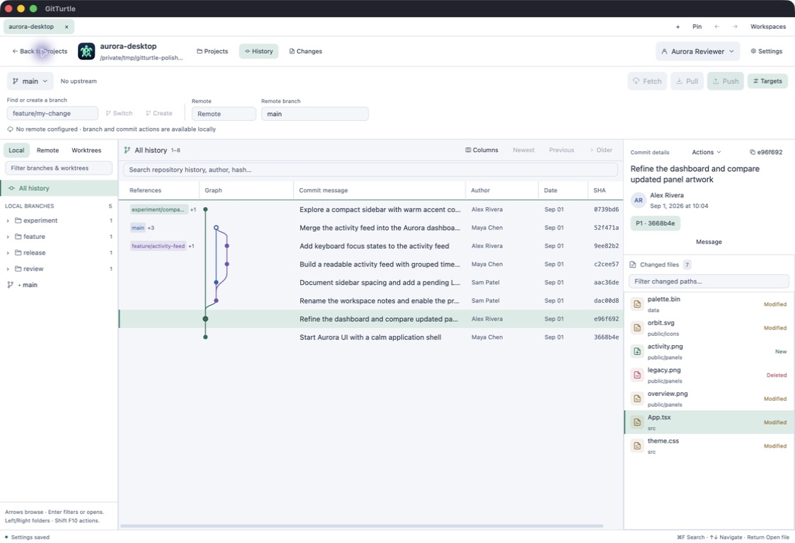
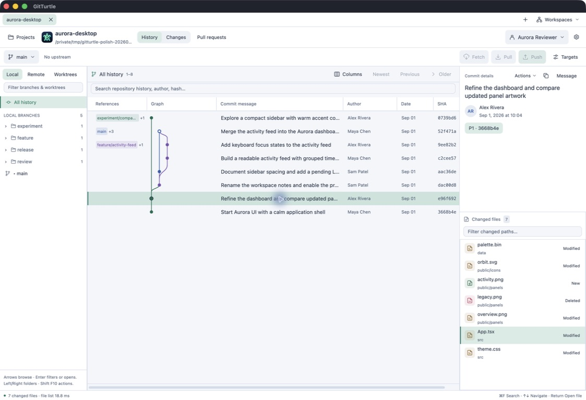
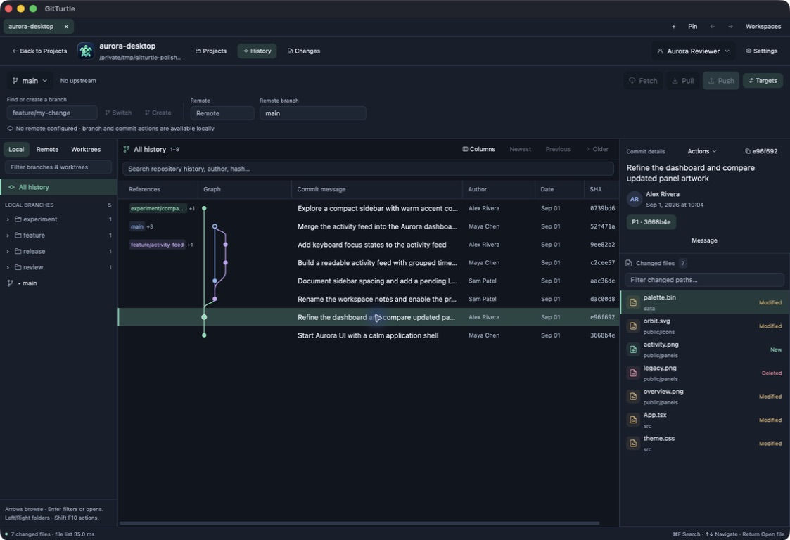
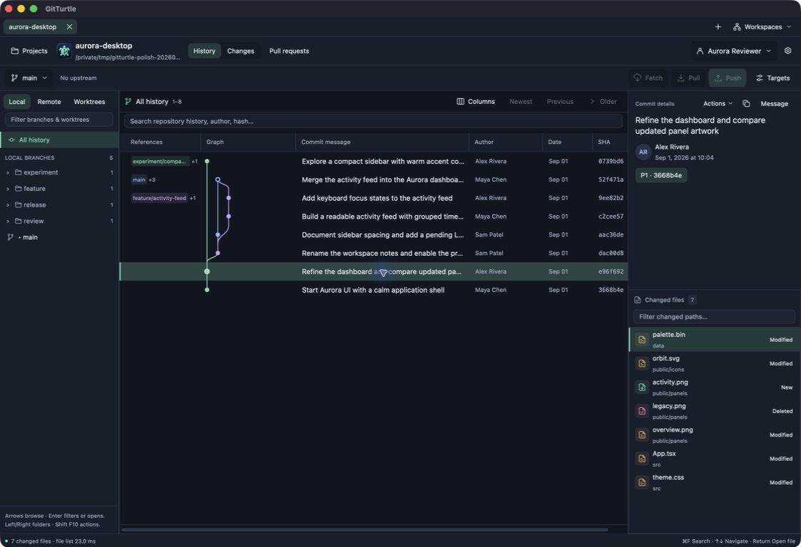
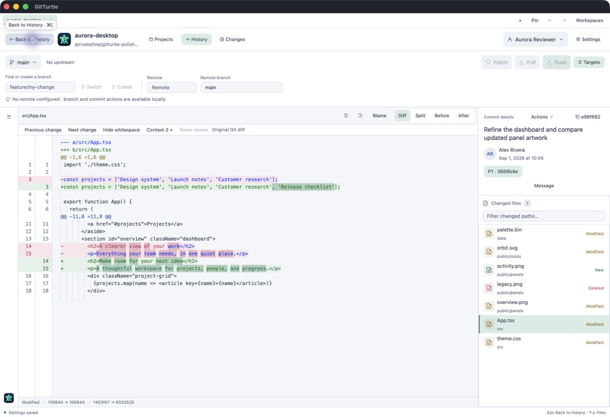
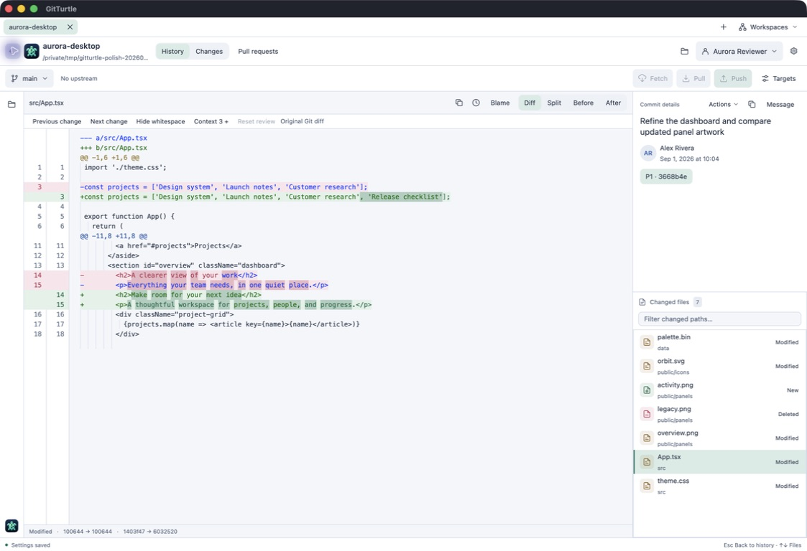
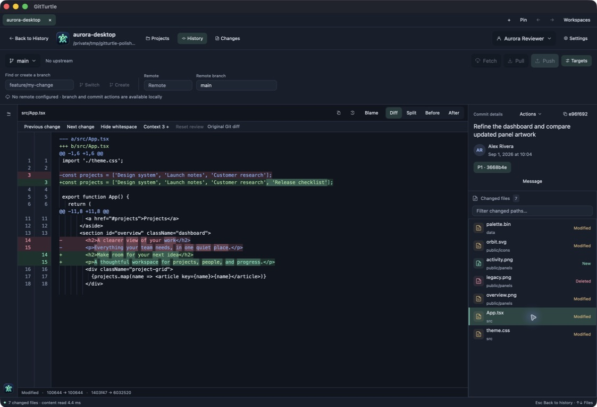
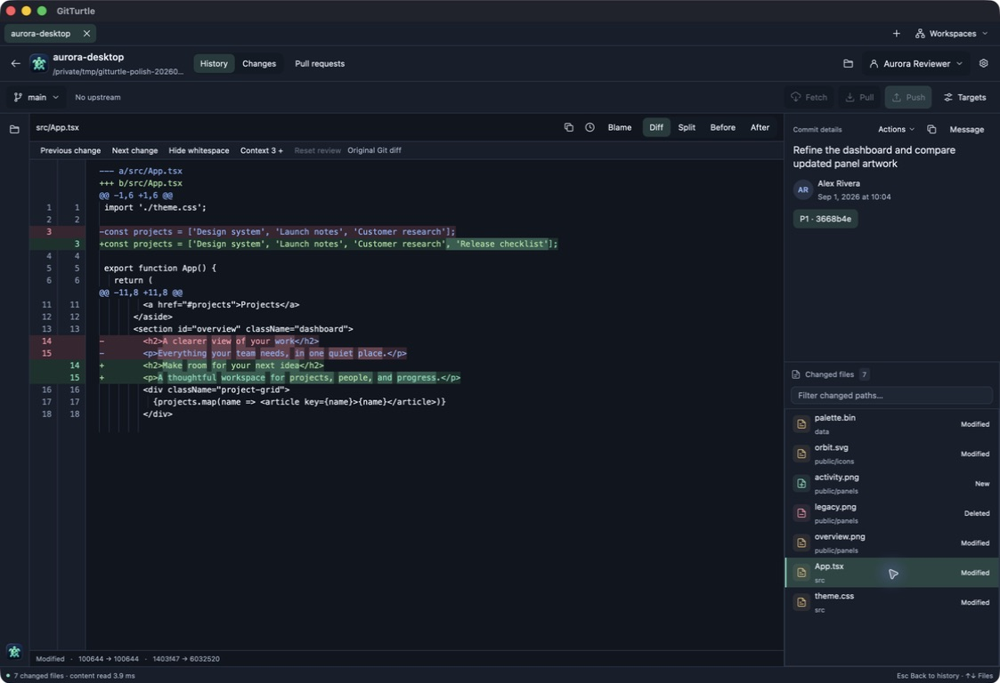

# Native UI visual evidence

These 32 native captures show disposable repositories and fixture profiles. Each
JPEG is copied byte for byte from the captured evidence, with no cropping,
re-encoding, compositing, or added framing. The four baseline captures originally
had `.png` filenames despite containing JPEG data; their copies use `.jpeg`.
[hashes.json](hashes.json) records the original filenames, SHA-256 hashes, byte
lengths, dimensions, and exercised source for every image.

The Aurora after-captures use final source `eb3dd264`; PR and conflict captures
retain their earlier `cc4ffac` identity. The native capture coordinator recorded
the final package executable SHA-256 as
`b2deab6aec9d33a77caab0fad7a814a927fbe862c7705f9effed3dcfdd70b610`
and UUID `37B51CFC-5658-3D0D-A83A-0C87DC4FA564`. Package and installation checks
are recorded in the [milestone ledger](../../../native-polish-milestone.md).
Screenshot bytes alone do not establish an installed package identity or a
performance gain.

| Capture group | Exercised source |
| --- | --- |
| Before: Aurora History and Compare | `ed9aa2102ff2d35d4d6cb714d2cf6724ed79eb64` |
| After: Aurora History and Compare | `eb3dd264c3d03eda7a3e937d307bf100c603ef02` |
| PR range; restored conflict draft | `cc4ffac27d3d1333547261e70d4986c5c1bb06a6` |
| Ten themes in both densities | `4ebe8fc834f7c03674828407e78ece29c6aa4d9c` |
| Captured Markdown Find and GIF Reduce Motion | `28a5d43522dedc7fb33bbbb68046f588ab6c8bca` |

The comparable Aurora captures use a traced 1480 × 981 content viewport,
Comfortable density, 13-point interface text, and 12-point code text. Every
retained JPEG is 1123 × 768 pixels as supplied by the capture tool, including the
window frame; raster dimensions and logical viewport dimensions are different
measurements. Both builds inspect Aurora commit `e96f692`; both Compare views
show `src/App.tsx`. History pairs show the same commit, changed-file list, and
selected file: `src/App.tsx` in Braden and `data/palette.bin` in Midnight.
Secondary Targets fields are expanded before and collapsed after. Click an image
to inspect the full capture.

| Workflow | Before · `ed9aa21` | After · `eb3dd264` |
| --- | --- | --- |
| History · Braden |  |  |
| History · Midnight |  |  |
| Compare · Braden |  |  |
| Compare · Midnight |  |  |

The theme matrix shows the same Aurora History selection, eight repository tabs,
and the open Workspaces menu. These `4ebe8fc` captures preserve both density
settings and their actual palette colors. They are visual evidence of shared
controls, selection, status words, and menu geometry; keyboard and accessibility
results remain in the milestone ledger.

| Theme | Comfortable · 1123 × 768 JPEG | Compact · 1123 × 768 JPEG |
| --- | --- | --- |
| Braden | [View](theme-braden-comfortable.jpeg) | [View](theme-braden-compact.jpeg) |
| Catppuccin Mocha | [View](theme-catppuccin-mocha-comfortable.jpeg) | [View](theme-catppuccin-mocha-compact.jpeg) |
| Deep Sea | [View](theme-deep-sea-comfortable.jpeg) | [View](theme-deep-sea-compact.jpeg) |
| Ember | [View](theme-ember-comfortable.jpeg) | [View](theme-ember-compact.jpeg) |
| Graphite | [View](theme-graphite-comfortable.jpeg) | [View](theme-graphite-compact.jpeg) |
| Midnight | [View](theme-midnight-comfortable.jpeg) | [View](theme-midnight-compact.jpeg) |
| Nord | [View](theme-nord-comfortable.jpeg) | [View](theme-nord-compact.jpeg) |
| Porcelain | [View](theme-porcelain-comfortable.jpeg) | [View](theme-porcelain-compact.jpeg) |
| Sandstone | [View](theme-sandstone-comfortable.jpeg) | [View](theme-sandstone-compact.jpeg) |
| Tokyo Night | [View](theme-tokyo-night-comfortable.jpeg) | [View](theme-tokyo-night-compact.jpeg) |

| Focused workflow · 1123 × 768 JPEG | Source | Visible state |
| --- | --- | --- |
| [PR range and draft](release-pr-range-midnight.jpeg) | `cc4ffac` | Offline PR fixture, selected After lines 2–3, unfinished inline comment, and retained older-head draft notice. |
| [Captured Markdown Find](verified-markdown-modal-find.jpeg) | `28a5d43` | Exact source of a captured companion document with its local Find query and match. |
| [Restored conflict draft](release-conflict-restored.jpeg) | `cc4ffac` | Exact recovered text, no unresolved result blocks, and available Save and stage result action. |
| [GIF with Reduce Motion](verified-gif-reduce-motion-on.jpeg) | `28a5d43` | Reduce Motion explanation, unavailable playback action, and manual frame controls. |

All images were inspected for visible personal data before copying. Their EXIF
contains image dimensions only; no identity, location, or capture-time EXIF tags
were found. The empty IPTC payload, JFIF information, and ICC color profile remain
unchanged with the original bytes. Genuine personal-profile and missing
real-repository captures are excluded from this collection.
