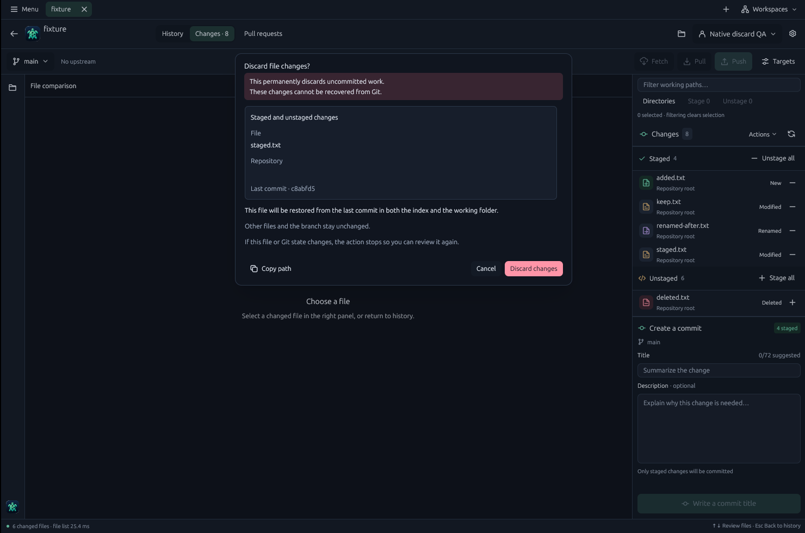
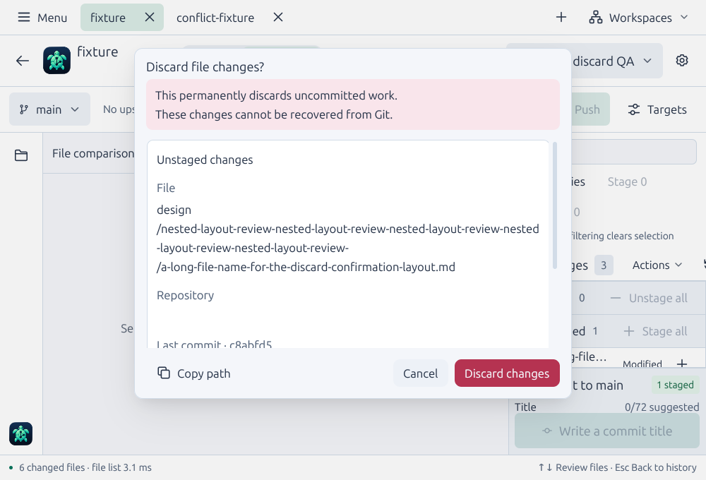
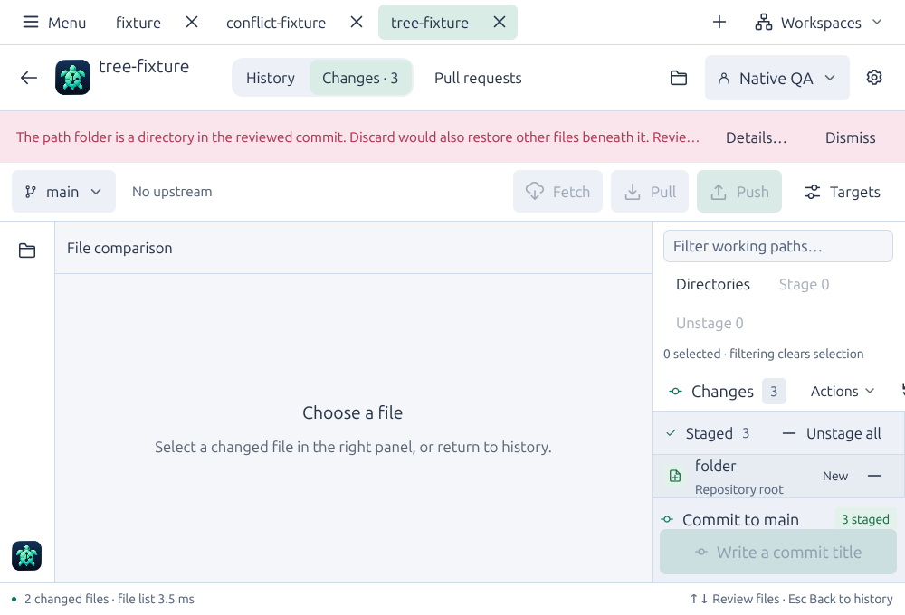

# File discard review validation — September 16, 2026

PR #17 includes main `5466b8a`. The review strengthened single-file discard and
untracked deletion, added a bounded destructive confirmation, and corrected
context-menu tooltip overlap. Native build source is
`e9b631f432856b7049505b811a2ff6effb04704c`; later evidence and test-fixture
corrections do not change the exercised production behavior.

## Preservation and independent review

General and independent security review found no remaining actionable findings
at that source. Four reproduced preservation defects were repaired:

- Equal-size file edits with restored timestamps bypassed metadata-only review.
  Bounded raw SHA-256 snapshots now detect changed bytes, including stored
  symlink targets, without following links or running filters during preparation.
- Repository configuration or administration-directory replacement could change
  the reviewed target. Preparation captures directory identity; execution resolves
  and checks it again and explicitly pins the private Git directory and worktree.
- Literal restore paths still select descendants. File/directory transitions
  could restore unreviewed committed files or remove neighboring staged entries.
  Raw source-tree and index checks now refuse these transitions at both rename
  endpoints. Ordinary nested-file discard preserves its staged sibling.
- Replacement refs could substitute an unreviewed tree during restore. Explicit
  discard now disables replacement objects, matching passive review, while
  retaining normal configured restore filters.

The global `includeIf`/`core.worktree` hypothesis did not reproduce on Git 2.43.0
and is not reported as a defect. A subprocess-isolated regression verifies that
the reviewed file is restored and external content is preserved with that
configuration loaded.

Review traced all changed core, app and documentation paths: passive plan
preparation, raw byte-safe targets, content and repository snapshots, explicit
restore/clean, postconditions, uncertain failures, dialog authority/lifetime,
navigation invalidation, diagnostics and persistence. Writes use the existing
serialized executor and never retry automatically. This does not lock out
concurrent external writers; filesystem deadlines remain cooperative between
syscalls. Files over 64 MiB and incomplete inspection refuse the action.

## Automated checks

On native build source `e9b631f`, these passed:

- `cargo test --locked --workspace`: **847 tests passed, zero failed, five
  existing ignores**. The renderer isolation subprocess repeats one passing test;
  that repetition is excluded from the count.
- `cargo clippy --locked --workspace --all-targets -- -D warnings` and
  `cargo fmt --all -- --check`.
- `python3 scripts/check-agent-guidance.py`, `git diff --check` and native debug
  compilation.

The suite includes 23 discard integration tests, two core snapshot tests and
seven consuming GPUI tests. Coverage includes stale content/index/HEAD,
repository redirection and replacement, symlinks and unsafe parents, byte limits,
cancellation, configured filters, non-UTF-8 and literal paths, rename endpoints,
source/index descendants, replacement objects and preservation of unrelated
staged/working content. GPUI checks cover inert initial Enter, deliberate focused
keyboard confirmation, duplicate submission, cancellation/navigation, stale
repository identity, long paths, enlarged text and tooltip dismissal.

Hosted CI subsequently exposed two test-fixture issues: a cloned submodule did
not inherit its source repository's local author identity, and rustix's
`mkfifoat` test helper was unavailable on macOS. The clone now receives explicit
local fixture identity with signing disabled; the FIFO fixture uses portable
`mkfifo`. Production behavior is unchanged. The corrected 23 integration tests
passed with system/global Git configuration disabled and `user.useConfigOnly`
enabled. The full 847-test workspace suite, strict Clippy and formatting passed
again with system/global Git configuration disabled. The machine-readable
record includes the exact corrected test-source digests; final hosted outcomes
remain on the PR.

## Native interaction

The real GPUI application ran on Pop!_OS 24.04 x86-64 with virtual X11, lavapipe
Vulkan and scale 1. Pointer/keyboard input and window screenshots were checked
against independent Git/index/filesystem results. All mutation checks used
disposable fixtures and isolated XDG stores. The isolated app and display were
closed afterward.

[Machine-readable evidence](screenshots/discard/validation.json) records all
three clean debug builds, screenshot identities and executable SHA-256 digests.
The final build used Rust 1.98.0 and has SHA-256
`9952233d067d36df20f14e80d996485684c67c574d577753b9344c5ae575dd3b`.

At `a1e6d77`, Midnight/Comfortable, 13-point text and 1480 × 980:

- Staged/unstaged review showed scope, full repository/path, loss warning and
  deliberate danger action. Initial Enter did nothing. An equal-size edit with
  restored timestamp refused confirmation and preserved working/index bytes.
  A fresh review restored HEAD while preserving sibling changes and all refs.
- Rename review showed both endpoints; End scrolled, Escape canceled, and
  Shift-Tab followed by Enter on the focused danger button restored the source
  and removed the destination.
- Pointer confirmation removed a newly added file from index/worktree and
  restored a deleted file from HEAD.

Daylight/Compact, 18-point text and the minimum 1000 × 680 window covered a long
path, scrolling with a fixed warning/footer, pointer cancellation and untracked
deletion. A conflicted row at 1480 × 980 retained its disabled discard action;
clicking it preserved conflict bytes and the unmerged index.

At `a25d900`, the full-path tooltip wrapped within its bounds and disappeared
when the context menu opened. Long-path confirmation and Escape still worked.
At final `e9b631f`, the minimum-size enlarged light UI refused a regular file
replacing a committed directory before confirmation, preserving exact staged
entries and replacement bytes. Fresh modified-file review again retained inert
initial Enter; pointer confirmation restored only the selected file, preserving
sibling index/worktree content, the long-path edit, HEAD and all refs.

## Coverage limits

These are local Linux debug/native results, not macOS native, physical Wayland,
screen-reader, installed-package or performance evidence. No speed improvement
is claimed. Hosted Linux/macOS checks and package results remain recorded on
[PR #17](https://github.com/FernandoX7/GitTurtle/pull/17), separately from this
local evidence. The quality workflow is unchanged by this PR.
