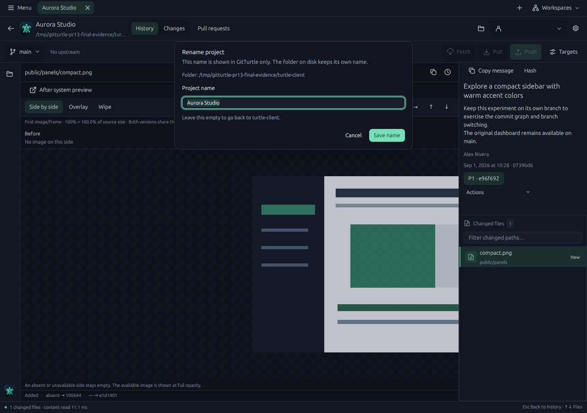
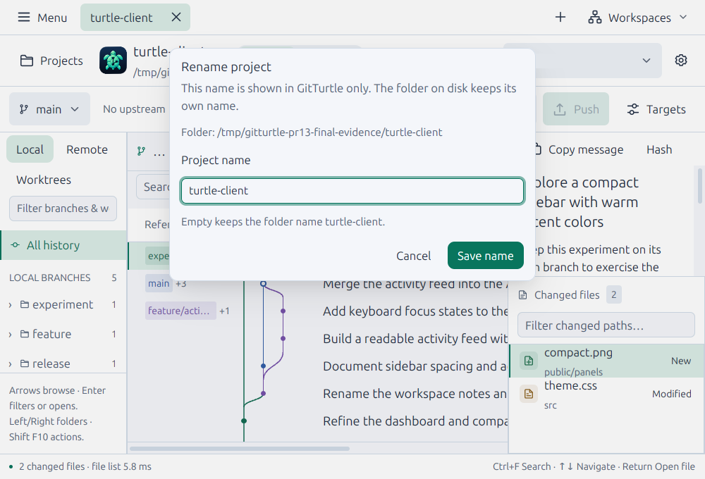
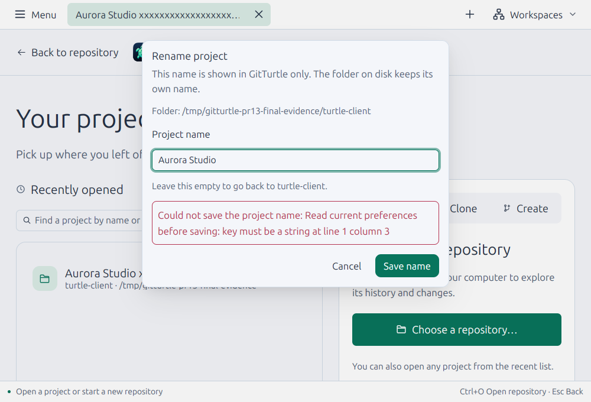
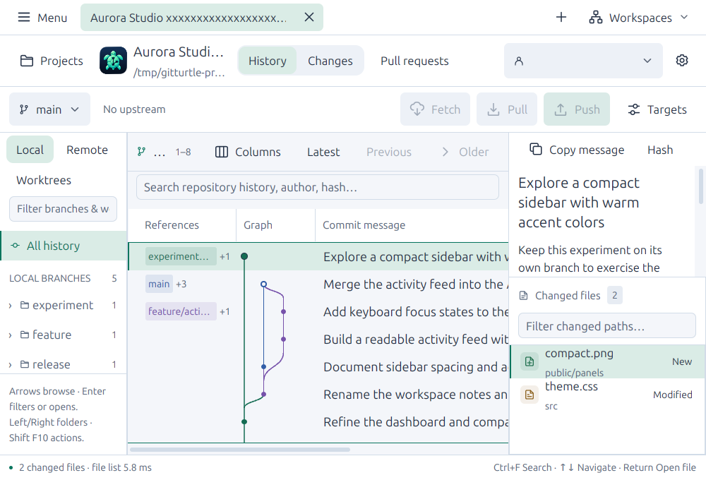

# Project name review validation — September 16, 2026

PR #13 includes main `a3c57ab`. The review addressed save failure recovery,
autofocus/select-all, cancellation, canonical discovery, and accessible project
identities. Additional fixes cover worktree-name filtering, saved-workspace
render ownership, Unicode line separators, and preservation of invalid stored
name sections.

The final native executable is clean source `2c981084813fe3b21a85844ae96ab781df51e89a`,
Rust 1.98.0, Linux x86-64 debug, SHA-256
`49ea1540d1070f1de19a7b6e669dfafa8aad2d4b34b61a5a9ee32fc5ef342e12`. [Machine-readable evidence](screenshots/project-names/validation.json)
records the exact build, fixture and limits. Subsequent documentation commits
do not change the exercised application source.

**Redacted 2026-09-24.** `dark-rename.png`, `light-large-long-name.png` and `light-large-rename.png` showed the maintainer's name in the profile button. It is filled with the surrounding background and no other pixel changed. Hashes in `validation.json` describe the original captures, which remain in Git history.

## Automated checks

- `cargo test --locked --workspace` passed at `6e4f872`: **816 passed, zero failed,
  five existing ignores**. The only subsequent code change removes a redundant
  `.into()` in one test; final-source strict Clippy compiled every test target.
- `cargo clippy --locked --workspace --all-targets -- -D warnings`,
  `cargo fmt --all -- --check`, native debug build, `git diff --check`, and
  `python3 scripts/check-agent-guidance.py` passed.
- Five GPUI rename tests exercise frame-delivered focus, cancellation, validation,
  duplicate submission and dismissal while pending, real asynchronous failure
  and retry against an isolated store, and stale completion with a newer dialog.
  Other regressions cover canonical discovery, aliases/unavailable targets,
  custom-name/path/branch filtering, bounded UTF-8 names, byte-safe paths, and
  preservation across every preference writer.

## Native checks

Used the generated disposable demo repository, isolated XDG configuration/data,
virtual X11 and software graphics. The real application was exercised in
Midnight/Comfortable at 13-point text and 1280 × 900, and Braden/Compact at
18-point text and the minimum 1000 × 680 window.

Both entry points opened a focused name field with its saved value selected.
Typing immediately replaced that value. Cancel followed by reopening restored
the saved value. A deliberately invalid fixture preferences file kept the dialog
open with an inline error and retained input; the original file remained intact.
After explicitly repairing that fixture file, retrying saved successfully and
updated the hub and tab. The repository had been opened through a symlink plus
nested `src` path; the saved key was its canonical worktree root.

A 128-byte name remained bounded in the tab and repository heading. Restart
retained the name. Clearing it removed the stored entry and restored the folder
label. The directory retained its original name and `git status --porcelain`
remained empty. Screenshots confirmed text, input focus, primary/secondary
controls and error layout fit at enlarged text/minimum size.

## Coverage limits

No new macOS, Wayland, physical-desktop, screen-reader, full ten-theme, installed
package or release-performance evidence is claimed. X11 automation needed
explicit window focus and paced button events; actions were checked against
screenshots and stored results. Hosted macOS/Linux results remain recorded on
[PR #13](https://github.com/FernandoX7/GitTurtle/pull/13), separately from these local checks.
